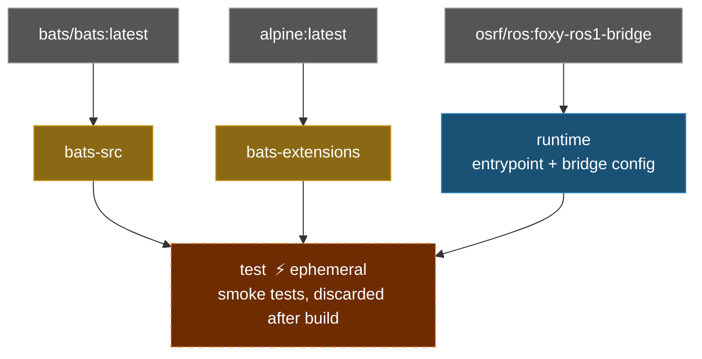

# ROS 1 Bridge Docker Environment

**[English](README.md)** | **[繁體中文](README.zh-TW.md)**

> **TL;DR** — ROS 1/2 bridge container based on `osrf/ros:foxy-ros1-bridge`. Bridges ROS 1 (Noetic) and ROS 2 (Foxy) topics via `parameter_bridge`.
>
> ```bash
> ./build.sh && ./run.sh
> ```

---

## Table of Contents

- [Features](#features)
- [Quick Start](#quick-start)
- [Usage](#usage)
- [Bridge Configuration](#bridge-configuration)
- [Architecture](#architecture)
- [Directory Structure](#directory-structure)

---

## Features

- **Pre-built bridge image**: based on `osrf/ros:foxy-ros1-bridge` with both ROS 1 and ROS 2
- **Parameter bridge**: configurable topic bridging via YAML
- **Smoke Test**: Bats tests verify both ROS environments and bridge availability
- **Docker Compose**: single `compose.yaml` for build and run
- **Example configs**: includes scan and camera bridge configurations

## Quick Start

```bash
# 1. Build
./build.sh

# 2. Run (requires ROS master running)
./run.sh

# 3. Enter running container
./exec.sh
```

## Usage

### Build

```bash
./build.sh                       # Build runtime (default)
./build.sh test                  # Build with smoke tests

docker compose build runtime     # Equivalent
```

### Run

```bash
./run.sh                         # Run with default bridge config

# Or with custom bridge mode
docker compose run --rm runtime ros2 run ros1_bridge dynamic_bridge
```

### Enter running container

```bash
./exec.sh
./exec.sh bash
```

## Bridge Configuration

The default bridge config is `bridge.yaml`. Additional configs are in `config/`:

| File | Description |
|------|-------------|
| `bridge.yaml` | Default config (LaserScan `/scan`) |
| `config/scan_bridge.yaml` | LaserScan bridge |
| `config/release_bridge.yaml` | Camera + depth topics bridge |

To use a different config, rebuild with:

```bash
docker compose build --build-arg BRIDGE_FILE=config/release_bridge.yaml runtime
```

### YAML Format

```yaml
topics:
  - topic: /scan
    type: sensor_msgs/msg/LaserScan
    queue_size: 10
```

## Architecture



## Directory Structure

```text
ros1_bridge/
├── compose.yaml                 # Docker Compose definition
├── Dockerfile                   # Multi-stage build (runtime + test)
├── build.sh                     # Build script
├── run.sh                       # Run script
├── exec.sh                      # Enter running container
├── entrypoint.sh                # Sources ROS 1 + ROS 2, loads bridge config
├── bridge.yaml                  # Default bridge configuration
├── config/                      # Additional bridge configs
│   ├── scan_bridge.yaml         # LaserScan bridge
│   └── release_bridge.yaml      # Camera + depth bridge
├── .github/workflows/           # CI/CD
│   ├── main.yaml
│   ├── build-worker.yaml
│   └── release-worker.yaml
└── smoke_test/                  # Bats environment tests
    ├── ros_env.bats
    └── test_helper.bash
```
