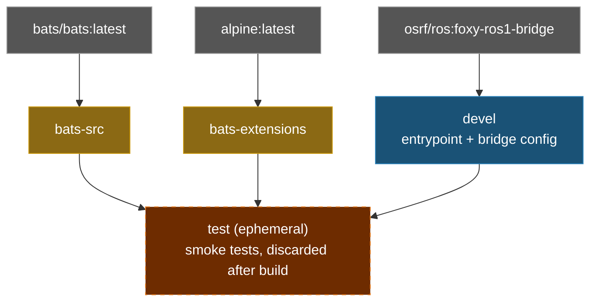

# ROS 1 Bridge Docker Environment

**[English](README.md)** | **[繁體中文](doc/README.zh-TW.md)** | **[简体中文](doc/README.zh-CN.md)** | **[日本語](doc/README.ja.md)**

> **TL;DR** — ROS 1/2 bridge container based on `osrf/ros:foxy-ros1-bridge`. Bridges ROS 1 (Noetic) and ROS 2 (Foxy) topics via `parameter_bridge`.
>
> ```bash
> ./build.sh && ./run.sh
> ```

---

## Table of Contents

- [Features](#features)
- [Quick Start](#quick-start)
- [Usage](#usage)
- [Bridge Configuration](#bridge-configuration)
- [Architecture](#architecture)
- [Directory Structure](#directory-structure)

---

## Features

- **Pre-built bridge image**: based on `osrf/ros:foxy-ros1-bridge` with both ROS 1 and ROS 2
- **Parameter bridge**: configurable topic bridging via YAML
- **Smoke Test**: Bats tests verify both ROS environments and bridge availability
- **Docker Compose**: single `compose.yaml` for build and run
- **Example configs**: includes scan and camera bridge configurations

## Quick Start

```bash
# 1. Build
./build.sh

# 2. Run (requires ROS master running)
./run.sh

# 3. Enter running container
./exec.sh
```

## Usage

### Build

```bash
./build.sh                       # Build devel (default)
./build.sh test                  # Build with smoke tests

docker compose build devel     # Equivalent
```

### Run

```bash
./run.sh                         # Run with default bridge config

# Or with custom bridge mode
docker compose run --rm devel ros2 run ros1_bridge dynamic_bridge
```

### Enter running container

```bash
./exec.sh
./exec.sh bash
```

## Bridge Configuration

The default bridge config is `bridge.yaml`. Additional configs are in `config/`:

| File | Description |
|------|-------------|
| `bridge.yaml` | Default config (LaserScan `/scan`) |
| `config/scan_bridge.yaml` | LaserScan bridge |
| `config/release_bridge.yaml` | Camera + depth topics bridge |

To use a different config, rebuild with:

```bash
docker compose build --build-arg BRIDGE_FILE=config/release_bridge.yaml devel
```

### YAML Format

```yaml
topics:
  - topic: /scan
    type: sensor_msgs/msg/LaserScan
    queue_size: 10
```

## Architecture


```mermaid
graph TD
    EXT1["bats/bats:latest"]:::external
    EXT2["alpine:latest"]:::external
    EXT3["osrf/ros:foxy-ros1-bridge"]:::external

    EXT1 --> bats-src["bats-src"]:::tool
    EXT2 --> bats-ext["bats-extensions"]:::tool

    EXT3 --> devel["devel\nentrypoint + bridge config"]:::stage

    bats-src --> test["test (ephemeral)\nsmoke tests, discarded after build"]:::ephemeral
    bats-ext --> test
    devel --> test

    classDef external fill:#555,color:#fff,stroke:#999
    classDef tool fill:#8B6914,color:#fff,stroke:#c8960c
    classDef stage fill:#1a5276,color:#fff,stroke:#2980b9
    classDef ephemeral fill:#6e2c00,color:#fff,stroke:#e67e22,stroke-dasharray:5 5
```

## Smoke Tests

```bash
./build.sh test
```

Located in `test/smoke/` — **20 tests** total.

<details>
<summary>Click to expand test details</summary>

#### ROS environment (4)

| Test | Description |
|------|-------------|
| ROS 1 (noetic) | `setup.bash` exists |
| ROS 2 (foxy) | `setup.bash` exists |
| ROS 1 | Environment can be sourced |
| ROS 2 | Environment can be sourced after ROS 1 |

#### Bridge (2)

| Test | Description |
|------|-------------|
| `ros1_bridge` | Package available |
| `bridge.yaml` | Config file exists |

#### System (2)

| Test | Description |
|------|-------------|
| `entrypoint.sh` | Exists and executable |
| `config/` | Directory exists |

#### Script help (12)

| Test | Description |
|------|-------------|
| `build.sh -h` | Exits 0 |
| `build.sh --help` | Exits 0 |
| `build.sh -h` | Prints usage |
| `run.sh -h` | Exits 0 |
| `run.sh --help` | Exits 0 |
| `run.sh -h` | Prints usage |
| `exec.sh -h` | Exits 0 |
| `exec.sh --help` | Exits 0 |
| `exec.sh -h` | Prints usage |
| `stop.sh -h` | Exits 0 |
| `stop.sh --help` | Exits 0 |
| `stop.sh -h` | Prints usage |

</details>

## Directory Structure

```text
ros1_bridge/
├── compose.yaml                 # Docker Compose definition
├── Dockerfile                   # Multi-stage build (devel + test)
├── build.sh -> template/build.sh    # Symlink
├── run.sh -> template/run.sh        # Symlink
├── exec.sh -> template/exec.sh      # Symlink
├── stop.sh -> template/stop.sh      # Symlink
├── Makefile -> template/Makefile    # Symlink
├── .template_version            # Template subtree version (v0.4.1)
├── template/                    # Shared scripts, tests, CI (git subtree)
├── script/
│   └── entrypoint.sh            # Sources ROS 1 + ROS 2, loads bridge config
├── bridge.yaml                  # Default bridge configuration
├── config/                      # Additional bridge configs
│   ├── scan_bridge.yaml         # LaserScan bridge
│   └── release_bridge.yaml      # Camera + depth bridge
├── doc/                         # Translated READMEs
│   ├── README.zh-TW.md          # Traditional Chinese
│   ├── README.zh-CN.md          # Simplified Chinese
│   └── README.ja.md             # Japanese
├── .github/workflows/
│   └── main.yaml                # CI/CD (calls template reusable workflows)
└── test/smoke/                  # Bats environment tests (repo-specific)
    └── ros_env.bats
```
