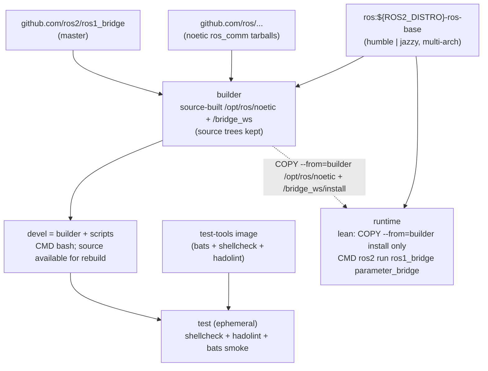

# ROS 1 Bridge Docker Environment

[](https://github.com/ycpss91255-docker/ros1_bridge/actions/workflows/main.yaml) [](./LICENSE)

ROS 1/2 bridge container with dual Humble + Jazzy targets — `ros:${ROS2_DISTRO}-ros-base` plus source-built Noetic `ros_comm` and `ros1_bridge`. Multi-arch (amd64 / arm64).

**[English](README.md)** | **[繁體中文](doc/README.zh-TW.md)** | **[简体中文](doc/README.zh-CN.md)** | **[日本語](doc/README.ja.md)**

---

## Table of Contents

- [TL;DR](#tldr)
- [Overview](#overview)
- [Features](#features)
- [Quick Start](#quick-start)
- [Switch ROS 2 distro](#switch-ros-2-distro)
- [Usage](#usage)
- [Bridge Configuration](#bridge-configuration)
- [Demo](#demo)
- [Architecture](#architecture)
- [Smoke Tests](#smoke-tests)
- [Directory Structure](#directory-structure)

---

## TL;DR

```bash
ln -sf config/ros1_bridge/demo_bridge.yaml bridge.yaml   # pick a bridge config (gitignored, per-clone). Skip to use the demo fallback.
make build && make run                       # default ROS2_DISTRO=humble (set via setup.conf [build] arg_4)
```

Skipping the `ln -sf` step is fine — the Dockerfile falls back to
`config/ros1_bridge/demo_bridge.yaml` automatically (closes [#65](https://github.com/ycpss91255-docker/ros1_bridge/issues/65)).
See [Bridge Configuration](#bridge-configuration) for the full set of available configs.

## Overview

The classic `osrf/ros:foxy-ros1-bridge` distribution path is broken on
modern hosts: Open Robotics never published `ros-noetic-*` debs outside
focal, and `ros-jazzy-ros1-bridge` does not exist. The chained DDS
workaround (`humble|jazzy ↔ foxy ↔ noetic`) was empirically ruled out
due to Fast-DDS major-version skew + REP-2011 type-hash mismatches.
This repo replaces it with a single Dockerfile that source-builds
Noetic `ros_comm` + `ros1_bridge` on top of `ros:${ROS2_DISTRO}-ros-base`,
selectable via `ARG ROS2_DISTRO=humble|jazzy`, multi-arch (amd64 + arm64
including Jetson). See [#53](https://github.com/ycpss91255-docker/ros1_bridge/issues/53)
for the full migration rationale.

## Features

- **Source-built ROS 1 + bridge**: `ros:${ROS2_DISTRO}-ros-base` base; Noetic `ros_comm` built from `rosinstall_generator` tarballs into `/opt/ros/noetic/`; `ros1_bridge` built from `ros2/ros1_bridge` master into `/bridge_ws/install/`. Both Humble (jammy) and Jazzy (noble) supported via `ARG ROS2_DISTRO` matrix.
- **Jetson (arm64) support**: multi-arch base image (unlike `osrf/ros:foxy-ros1-bridge`, which is amd64 only)
- **Parameter bridge**: configurable topic bridging via YAML
- **builder / devel / runtime split**: `builder` stage source-builds Noetic + `ros1_bridge` keeping the source trees in `/noetic_ws/src/` and `/bridge_ws/src/ros1_bridge/`; `devel` (`FROM builder`) keeps that source for in-container rebuild / debug + drops into a shell (`CMD bash`); `runtime` (`FROM ${IMAGE}` — NOT inheriting devel) is lean, only `COPY --from=builder` the install trees + auto-starts `parameter_bridge` from `/bridge.yaml`
- **Docker Compose**: single `compose.yaml` for build and run
- **Example configs**: includes scan and camera bridge configurations

## Quick Start

```bash
# 0. (Optional) Pick a bridge config. Skipping this falls back to
#    config/ros1_bridge/demo_bridge.yaml — see "Bridge Configuration" below.
ln -sf config/ros1_bridge/demo_bridge.yaml bridge.yaml

# 1. Build
make build

# 2. Run (requires ROS master running)
make run

# 3. Enter running container
make exec
```

## Switch ROS 2 distro

Default is `humble` (jammy 22.04). To switch to `jazzy` (noble 24.04), update
`setup.conf [build] arg_4` via the CLI:

```bash
./script/setup.sh set build.arg_4 ROS2_DISTRO=jazzy
make build && make run
```

`set` writes the value into `setup.conf [build] arg_4` (creating the
section / key if absent). `make build` then detects the drift via the
`setup.conf` hash baked into `.env`, regenerates `.env` + `compose.yaml`,
and rebuilds. The image tag (`yunchien/ros1_bridge:devel` etc.) is
unchanged across distros — switching rebuilds in place.

For an interactive picker, run `make setup-tui` (dialog / whiptail
frontend) and change `[build] arg_4` there.

CI builds both distros in parallel via the matrix in `.github/workflows/main.yaml`,
so a setup.conf change only affects local builds — published images at
`ghcr.io/ycpss91255-docker/ros1_bridge-{humble,jazzy}` come from the matrix
regardless of what `setup.conf` says.

## Usage

### Build

```bash
make build                       # Build devel (default)
make build test                  # Build with smoke tests
make build -- -t runtime         # Build the lean runtime image
```

### Run

Two modes, picked by stage target:

```bash
make run                         # devel: interactive bash shell, bridge NOT running
make run -- -d                   # devel detached, join via make exec
```

For `runtime` (auto-starts the bridge via the Dockerfile `CMD`):

```bash
make run -- -t runtime           # Start runtime service. Entrypoint sources both
                                 # ROS distros, rosparam loads /bridge.yaml, then
                                 # exec's `ros2 run ros1_bridge parameter_bridge`.
                                 # Requires roscore already running on the host network.
```

### Enter running container

```bash
make exec
make exec bash
```

## Bridge Configuration

`bridge.yaml` is **not committed** — it is a per-clone symlink the operator
points at one of the configs in `config/`. If the symlink is missing or
broken at build time, the Dockerfile falls back to `config/ros1_bridge/demo_bridge.yaml`
(closes [#65](https://github.com/ycpss91255-docker/ros1_bridge/issues/65)),
so a fresh clone builds out of the box. To pick a different config:

```bash
ln -sf config/ros1_bridge/scan_bridge.yaml bridge.yaml          # LaserScan
ln -sf config/ros1_bridge/release_bridge.yaml bridge.yaml       # RealSense camera + depth
ln -sf config/ros1_bridge/demo_bridge.yaml bridge.yaml          # std_msgs/String chatter demo (also the fallback)
ln -sf config/ros1_bridge/demo_services_1to2.yaml bridge.yaml   # ROS 1 → ROS 2 service demo
ln -sf config/ros1_bridge/demo_services_2to1.yaml bridge.yaml   # ROS 2 → ROS 1 service demo
```

| Config | Bridges |
|--------|---------|
| `config/ros1_bridge/scan_bridge.yaml` | LaserScan `/scan` (sensor-data QoS) |
| `config/ros1_bridge/release_bridge.yaml` | RealSense camera + depth topics |
| `config/ros1_bridge/demo_bridge.yaml` | Bidirectional `std_msgs/String` chatter (used by `ros{1,2}_server.sh` demos) |
| `config/ros1_bridge/demo_services_1to2.yaml` | ROS 1 services exposed to ROS 2 (`/add_two_ints`, `/static_map`) |
| `config/ros1_bridge/demo_services_2to1.yaml` | ROS 2 services exposed to ROS 1 (`/get_parameters`) |

> The two service demos require type conversions that are not compiled
> into the source-built `ros1_bridge` here either — they will print `no
> conversion for type ...` at runtime unless the image is rebuilt with
> the matching ROS 1 / ROS 2 packages added to the `colcon build` step.

### YAML Format

Topic `type` uses the ROS 2 form `<package>/msg/<MsgName>`; service `type`
uses the ROS 1 form `<package>/<SrvName>` (this asymmetry is intentional in
`parameter_bridge`). Per-topic QoS is supported via the `qos` key; see
the files in [`config/`](config/) for the full set of tunables.

```yaml
topics:
  - topic: /scan
    type: sensor_msgs/msg/LaserScan
    queue_size: 10
    qos:
      history: keep_last
      depth: 5
      reliability: best_effort
      durability: volatile

services_1_to_2:
  - service: /add_two_ints
    type: example_interfaces/AddTwoInts

services_2_to_1:
  - service: /get_parameters
    type: rcl_interfaces/GetParameters
```

## Demo

Two-terminal end-to-end bridge demo using `std_msgs/String`. Both demos
use the same pattern: a **server** terminal that owns `roscore` +
`parameter_bridge` (loaded from the baked-in `/demo_bridge.yaml`), and a
**client** terminal that just subscribes.

| Demo | Terminal 1 (server) | Terminal 2 (client) |
|------|---------------------|---------------------|
| A — ROS 1 → ROS 2 | `make exec -- /root/demo/ros1_server.sh` | `make exec -- /root/demo/ros2_client.sh` |
| B — ROS 2 → ROS 1 | `make exec -- /root/demo/ros2_server.sh` | `make exec -- /root/demo/ros1_client.sh` |

Steps (assuming the container is up via `make run -- -d`):

```bash
# Terminal 1 (server) — pick one demo
make exec -- /root/demo/ros1_server.sh    # Demo A
make exec -- /root/demo/ros2_server.sh    # Demo B

# Terminal 2 (client) — matching pair
make exec -- /root/demo/ros2_client.sh    # Demo A
make exec -- /root/demo/ros1_client.sh    # Demo B
```

Server scripts log every step (`[ros1_server] step N/5: ...`) so it's
clear when `roscore` and `parameter_bridge` are up. Override the
published string with `MESSAGE`:

```bash
./script/exec.sh env MESSAGE="hi from ROS 1" /root/demo/ros1_server.sh
```

`Ctrl+C` on the server terminal tears down `parameter_bridge` and
`roscore`; the client terminal then EOFs.

## Architecture


```mermaid
graph TD
    EXT1["test-tools image\n(bats + shellcheck + hadolint)"]
    EXT3["ros:${ROS2_DISTRO}-ros-base\n(humble | jazzy, multi-arch)"]
    EXT4["github.com/ros/...\n(noetic ros_comm tarballs)"]
    EXT5["github.com/ros2/ros1_bridge\n(master)"]

    EXT3 --> builder["builder\nsource-built /opt/ros/noetic + /bridge_ws\n(source trees kept)"]
    EXT4 --> builder
    EXT5 --> builder

    builder --> devel["devel = builder + scripts\nCMD bash; source available for rebuild"]

    EXT3 --> runtime["runtime\nlean: COPY --from=builder install only\nCMD ros2 run ros1_bridge parameter_bridge"]
    builder -.->|COPY --from=builder /opt/ros/noetic + /bridge_ws/install| runtime

    EXT1 --> test["test (ephemeral)\nshellcheck + hadolint + bats smoke"]
    devel --> test

```

## Smoke Tests

See [TEST.md](doc/test/TEST.md) for details.

## Directory Structure

```text
ros1_bridge/
├── compose.yaml                 # Docker Compose definition
├── Dockerfile                   # Multi-stage build (devel + runtime + test); source-builds Noetic + ros1_bridge
├── setup.conf                   # Repo override; [build] arg_4=ROS2_DISTRO selects humble|jazzy
├── Makefile -> .base/script/docker/Makefile     # Symlink (canonical entry: make build/run/exec/stop)
├── .base/                    # Shared scripts, tests, CI (git subtree; version pinned in .base/.version)
├── script/
│   ├── build.sh -> ../.base/script/docker/build.sh    # Wrapper symlinks
│   ├── run.sh -> ../.base/script/docker/run.sh
│   ├── exec.sh -> ../.base/script/docker/exec.sh
│   ├── stop.sh -> ../.base/script/docker/stop.sh
│   ├── setup.sh -> ../.base/script/docker/setup.sh
│   ├── setup_tui.sh -> ../.base/script/docker/setup_tui.sh
│   ├── prune.sh -> ../.base/script/docker/prune.sh
│   ├── entrypoint.sh            # Sources ROS 1 + ROS 2, loads bridge config
│   ├── ros_entrypoint.sh        # ROS env only (osrf-compatible)
│   ├── ros1_server.sh           # Demo A publisher (bootstraps roscore + bridge)
│   ├── ros1_client.sh           # Demo B subscriber
│   ├── ros2_server.sh           # Demo B publisher (bootstraps roscore + bridge)
│   └── ros2_client.sh           # Demo A subscriber
├── bridge.yaml                  # Symlink to one of config/ros1_bridge/*.yaml (gitignored, operator picks)
├── config/
│   └── ros1_bridge/             # Bridge configs (namespaced; frees config/ for template overlays)
│       ├── scan_bridge.yaml         # LaserScan bridge
│       ├── release_bridge.yaml      # Camera + depth bridge
│       ├── demo_bridge.yaml         # Bidirectional std_msgs/String chatter (also the fallback)
│       ├── demo_services_1to2.yaml  # ROS 1 → ROS 2 service demo
│       └── demo_services_2to1.yaml  # ROS 2 → ROS 1 service demo
├── doc/                         # Translated READMEs
│   ├── README.zh-TW.md          # Traditional Chinese
│   ├── README.zh-CN.md          # Simplified Chinese
│   └── README.ja.md             # Japanese
├── .github/workflows/
│   └── main.yaml                # CI/CD (calls template reusable workflows)
└── test/smoke/                  # Bats environment tests (repo-specific)
    └── ros_env.bats
```
