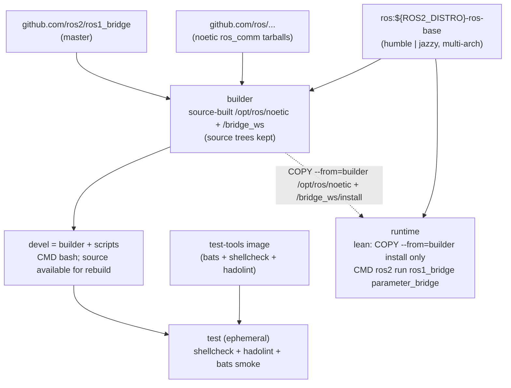

# ROS 1 Bridge Docker Environment

**[English](README.md)** | **[繁體中文](doc/README.zh-TW.md)** | **[简体中文](doc/README.zh-CN.md)** | **[日本語](doc/README.ja.md)**

> **TL;DR** — ROS 1/2 bridge container with **dual Humble + Jazzy targets** built from `ros:${ROS2_DISTRO}-ros-base` plus **source-built Noetic `ros_comm`** + **source-built `ros1_bridge`** (since Foxy / Noetic apt is no longer available outside focal). Select target via `ARG ROS2_DISTRO=humble|jazzy`. Multi-arch base supports Jetson (arm64). See [#53](https://github.com/ycpss91255-docker/ros1_bridge/issues/53) for the full migration rationale.
>
> ```bash
> ./build.sh && ./run.sh           # default ROS2_DISTRO=jazzy (set via setup.conf [build] arg_4)
> ```

---

## Table of Contents

- [Features](#features)
- [Quick Start](#quick-start)
- [Usage](#usage)
- [Bridge Configuration](#bridge-configuration)
- [Demo](#demo)
- [Architecture](#architecture)
- [Directory Structure](#directory-structure)

---

## Features

- **Source-built ROS 1 + bridge**: `ros:${ROS2_DISTRO}-ros-base` base; Noetic `ros_comm` built from `rosinstall_generator` tarballs into `/opt/ros/noetic/`; `ros1_bridge` built from `ros2/ros1_bridge` master into `/bridge_ws/install/`. Both Humble (jammy) and Jazzy (noble) supported via `ARG ROS2_DISTRO` matrix.
- **Why source-build**: Open Robotics never published `ros-noetic-*` debs outside focal, and `ros-jazzy-ros1-bridge` does not exist. The chained DDS workaround (`humble|jazzy ↔ foxy ↔ noetic`) was empirically ruled out due to Fast-DDS major version skew + REP-2011 type-hash mismatches — see [#53](https://github.com/ycpss91255-docker/ros1_bridge/issues/53) for the full investigation.
- **Jetson (arm64) support**: multi-arch base image (unlike `osrf/ros:foxy-ros1-bridge`, which is amd64 only)
- **Parameter bridge**: configurable topic bridging via YAML
- **builder / devel / runtime split**: `builder` stage source-builds Noetic + `ros1_bridge` keeping the source trees in `/noetic_ws/src/` and `/bridge_ws/src/ros1_bridge/`; `devel` (`FROM builder`) keeps that source for in-container rebuild / debug + drops into a shell (`CMD bash`); `runtime` (`FROM ${IMAGE}` — NOT inheriting devel) is lean, only `COPY --from=builder` the install trees + auto-starts `parameter_bridge` from `/bridge.yaml`
- **Dual entrypoints**: `/entrypoint.sh` (sources both ROS distros + `rosparam load /bridge.yaml`) and `/ros_entrypoint.sh` (ROS env only, matches osrf convention)
- **Smoke Test**: Bats tests verify both ROS environments and bridge availability
- **Docker Compose**: single `compose.yaml` for build and run
- **Example configs**: includes scan and camera bridge configurations

## Quick Start

```bash
# 1. Build
./build.sh

# 2. Run (requires ROS master running)
./run.sh

# 3. Enter running container
./exec.sh
```

## Usage

### Build

```bash
./build.sh                       # Build devel (default)
./build.sh test                  # Build with smoke tests

docker compose build devel     # Equivalent
```

### Run

Two modes, picked by stage target:

```bash
./run.sh                         # devel: interactive bash shell, bridge NOT running
./run.sh -d                      # devel detached, join via ./exec.sh
```

For `runtime` (auto-bridge) you currently need a direct `docker run` — the
auto-generated `compose.yaml` does not yet emit a `runtime` service
(tracked upstream in template):

```bash
docker build --target runtime -t ros1_bridge:runtime .
docker run --rm --network=host ros1_bridge:runtime
# entrypoint sources both ROS distros, rosparam loads /bridge.yaml,
# then exec's `ros2 run ros1_bridge parameter_bridge`.
# Requires roscore already running on the host network.
```

### Enter running container

```bash
./exec.sh
./exec.sh bash
```

## Bridge Configuration

`bridge.yaml` is **not committed** — pick one of the configs in `config/`
and symlink it before building:

```bash
ln -sf config/scan_bridge.yaml bridge.yaml          # LaserScan
ln -sf config/release_bridge.yaml bridge.yaml       # RealSense camera + depth
ln -sf config/demo_bridge.yaml bridge.yaml          # std_msgs/String chatter demo
ln -sf config/demo_services_1to2.yaml bridge.yaml   # ROS 1 → ROS 2 service demo
ln -sf config/demo_services_2to1.yaml bridge.yaml   # ROS 2 → ROS 1 service demo
```

| Config | Bridges |
|--------|---------|
| `config/scan_bridge.yaml` | LaserScan `/scan` (sensor-data QoS) |
| `config/release_bridge.yaml` | RealSense camera + depth topics |
| `config/demo_bridge.yaml` | Bidirectional `std_msgs/String` chatter (used by `ros{1,2}_server.sh` demos) |
| `config/demo_services_1to2.yaml` | ROS 1 services exposed to ROS 2 (`/add_two_ints`, `/static_map`) |
| `config/demo_services_2to1.yaml` | ROS 2 services exposed to ROS 1 (`/get_parameters`) |

> The two service demos require type conversions that are not compiled
> into the source-built `ros1_bridge` here either — they will print `no
> conversion for type ...` at runtime unless the image is rebuilt with
> the matching ROS 1 / ROS 2 packages added to the `colcon build` step.

Override at build time without changing the symlink:

```bash
docker compose build --build-arg BRIDGE_FILE=config/release_bridge.yaml devel
```

### YAML Format

Topic `type` uses the ROS 2 form `<package>/msg/<MsgName>`; service `type`
uses the ROS 1 form `<package>/<SrvName>` (this asymmetry is intentional in
`parameter_bridge`). Per-topic QoS is supported via the `qos` key; see
the files in [`config/`](config/) for the full set of tunables.

```yaml
topics:
  - topic: /scan
    type: sensor_msgs/msg/LaserScan
    queue_size: 10
    qos:
      history: keep_last
      depth: 5
      reliability: best_effort
      durability: volatile

services_1_to_2:
  - service: /add_two_ints
    type: example_interfaces/AddTwoInts

services_2_to_1:
  - service: /get_parameters
    type: rcl_interfaces/GetParameters
```

## Demo

Two-terminal end-to-end bridge demo using `std_msgs/String`. Both demos
use the same pattern: a **server** terminal that owns `roscore` +
`parameter_bridge` (loaded from the baked-in `/demo_bridge.yaml`), and a
**client** terminal that just subscribes.

| Demo | Terminal 1 (server) | Terminal 2 (client) |
|------|---------------------|---------------------|
| A — ROS 1 → ROS 2 | `./exec.sh /ros1_server.sh` | `./exec.sh /ros2_client.sh` |
| B — ROS 2 → ROS 1 | `./exec.sh /ros2_server.sh` | `./exec.sh /ros1_client.sh` |

Steps (assuming the container is up via `./run.sh -d`):

```bash
# Terminal 1 (server) — pick one demo
./exec.sh /ros1_server.sh    # Demo A
./exec.sh /ros2_server.sh    # Demo B

# Terminal 2 (client) — matching pair
./exec.sh /ros2_client.sh    # Demo A
./exec.sh /ros1_client.sh    # Demo B
```

Server scripts log every step (`[ros1_server] step N/5: ...`) so it's
clear when `roscore` and `parameter_bridge` are up. Override the
published string with `MESSAGE`:

```bash
./exec.sh env MESSAGE="hi from ROS 1" /ros1_server.sh
```

`Ctrl+C` on the server terminal tears down `parameter_bridge` and
`roscore`; the client terminal then EOFs.

## Architecture


```mermaid
graph TD
    EXT1["test-tools image\n(bats + shellcheck + hadolint)"]
    EXT3["ros:${ROS2_DISTRO}-ros-base\n(humble | jazzy, multi-arch)"]
    EXT4["github.com/ros/...\n(noetic ros_comm tarballs)"]
    EXT5["github.com/ros2/ros1_bridge\n(master)"]

    EXT3 --> builder["builder\nsource-built /opt/ros/noetic + /bridge_ws\n(source trees kept)"]
    EXT4 --> builder
    EXT5 --> builder

    builder --> devel["devel = builder + scripts\nCMD bash; source available for rebuild"]

    EXT3 --> runtime["runtime\nlean: COPY --from=builder install only\nCMD ros2 run ros1_bridge parameter_bridge"]
    builder -.->|COPY --from=builder /opt/ros/noetic + /bridge_ws/install| runtime

    EXT1 --> test["test (ephemeral)\nshellcheck + hadolint + bats smoke"]
    devel --> test

```

## Smoke Tests

See [TEST.md](doc/test/TEST.md) for details.

## Directory Structure

```text
ros1_bridge/
├── compose.yaml                 # Docker Compose definition
├── Dockerfile                   # Multi-stage build (devel + runtime + test); source-builds Noetic + ros1_bridge
├── setup.conf                   # Repo override; [build] arg_4=ROS2_DISTRO selects humble|jazzy
├── build.sh -> template/build.sh    # Symlink
├── run.sh -> template/run.sh        # Symlink
├── exec.sh -> template/exec.sh      # Symlink
├── stop.sh -> template/stop.sh      # Symlink
├── Makefile -> template/Makefile    # Symlink
├── .template_version            # Template subtree version (v0.4.1)
├── template/                    # Shared scripts, tests, CI (git subtree)
├── script/
│   ├── entrypoint.sh            # Sources ROS 1 + ROS 2, loads bridge config
│   ├── ros_entrypoint.sh        # ROS env only (osrf-compatible)
│   ├── ros1_server.sh           # Demo A publisher (bootstraps roscore + bridge)
│   ├── ros1_client.sh           # Demo B subscriber
│   ├── ros2_server.sh           # Demo B publisher (bootstraps roscore + bridge)
│   └── ros2_client.sh           # Demo A subscriber
├── bridge.yaml                  # Symlink to one of config/*.yaml (gitignored, operator picks)
├── config/                      # Bridge configs
│   ├── scan_bridge.yaml         # LaserScan bridge
│   ├── release_bridge.yaml     # Camera + depth bridge
│   ├── demo_bridge.yaml         # Bidirectional std_msgs/String chatter
│   ├── demo_services_1to2.yaml  # ROS 1 → ROS 2 service demo
│   └── demo_services_2to1.yaml  # ROS 2 → ROS 1 service demo
├── doc/                         # Translated READMEs
│   ├── README.zh-TW.md          # Traditional Chinese
│   ├── README.zh-CN.md          # Simplified Chinese
│   └── README.ja.md             # Japanese
├── .github/workflows/
│   └── main.yaml                # CI/CD (calls template reusable workflows)
└── test/smoke/                  # Bats environment tests (repo-specific)
    └── ros_env.bats
```
