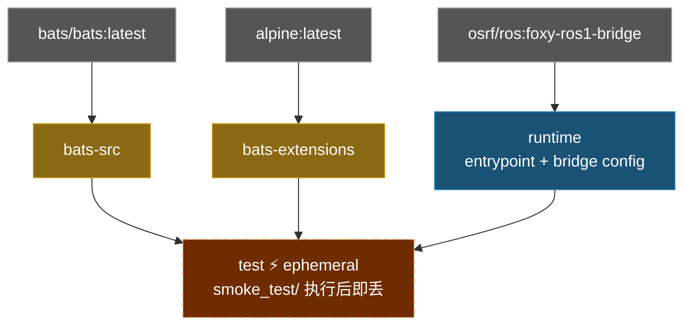

# ROS 1 Bridge Docker Environment

**[English](README.md)** | **[繁體中文](README.zh-TW.md)** | **[简体中文](README.zh-CN.md)** | **[日本語](README.ja.md)**

> **TL;DR** — 基于 `osrf/ros:foxy-ros1-bridge` 的 ROS 1/2 bridge 容器。通过 `parameter_bridge` 桥接 ROS 1 (Noetic) 与 ROS 2 (Foxy) topics。
>
> ```bash
> ./build.sh && ./run.sh
> ```

---

## 目录

- [特性](#特性)
- [快速开始](#快速开始)
- [使用方式](#使用方式)
- [Bridge 设置](#bridge-设置)
- [架构](#架构)
- [目录结构](#目录结构)

---

## 特性

- **预建 bridge 镜像**：基于 `osrf/ros:foxy-ros1-bridge`，同时包含 ROS 1 和 ROS 2
- **Parameter bridge**：通过 YAML 设置可配置的 topic 桥接
- **Smoke Test**：Bats 测试验证两个 ROS 环境及 bridge 可用性
- **Docker Compose**：一个 `compose.yaml` 管理构建与执行
- **示例设置**：内含 scan 和 camera bridge 设置文件

## 快速开始

```bash
# 1. 构建
./build.sh

# 2. 执行（需要 ROS master 已启动）
./run.sh

# 3. 进入已启动的容器
./exec.sh
```

## 使用方式

### 构建

```bash
./build.sh                       # 构建 runtime（默认）
./build.sh test                  # 构建含 smoke test

docker compose build runtime     # 等效命令
```

### 执行

```bash
./run.sh                         # 以默认 bridge 设置执行

# 或使用自定义 bridge 模式
docker compose run --rm runtime ros2 run ros1_bridge dynamic_bridge
```

### 进入已启动的容器

```bash
./exec.sh
./exec.sh bash
```

## Bridge 设置

默认 bridge 设置为 `bridge.yaml`。额外设置文件在 `config/` 目录：

| 文件 | 说明 |
|------|------|
| `bridge.yaml` | 默认设置（LaserScan `/scan`） |
| `config/scan_bridge.yaml` | LaserScan bridge |
| `config/release_bridge.yaml` | Camera + depth topics bridge |

使用不同设置重新构建：

```bash
docker compose build --build-arg BRIDGE_FILE=config/release_bridge.yaml runtime
```

### YAML 格式

```yaml
topics:
  - topic: /scan
    type: sensor_msgs/msg/LaserScan
    queue_size: 10
```

## 架构



## Smoke Tests

```bash
./build.sh test
```

位于 `smoke_test/ros_env.bats`，共 **8** 项。

<details>
<summary>展开查看测试详情</summary>

#### ROS 环境 (4)

| 测试项目 | 说明 |
|----------|------|
| ROS 1 (noetic) | `setup.bash` 存在 |
| ROS 2 (foxy) | `setup.bash` 存在 |
| ROS 1 | 环境可 source |
| ROS 2 | source ROS 1 后环境可 source |

#### Bridge (2)

| 测试项目 | 说明 |
|----------|------|
| `ros1_bridge` | package 可用 |
| `bridge.yaml` | 设置文件存在 |

#### 系统 (2)

| 测试项目 | 说明 |
|----------|------|
| `entrypoint.sh` | 存在且可执行 |
| `config/` | 目录存在 |

</details>

## 目录结构

```text
ros1_bridge/
├── compose.yaml                 # Docker Compose 定义
├── Dockerfile                   # 多阶段构建（runtime + test）
├── build.sh                     # 构建脚本
├── run.sh                       # 执行脚本
├── exec.sh                      # 进入已启动的容器
├── entrypoint.sh                # Source ROS 1 + ROS 2，载入 bridge 设置
├── bridge.yaml                  # 默认 bridge 设置
├── config/                      # 额外 bridge 设置
│   ├── scan_bridge.yaml         # LaserScan bridge
│   └── release_bridge.yaml      # Camera + depth bridge
├── .github/workflows/           # CI/CD
│   ├── main.yaml
│   ├── build-worker.yaml
│   └── release-worker.yaml
└── smoke_test/                  # Bats 环境测试
    ├── ros_env.bats
    └── test_helper.bash
```
