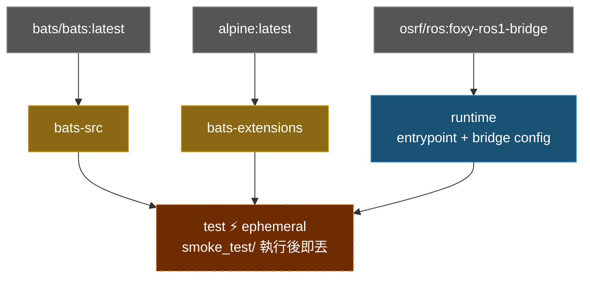

# ROS 1 Bridge Docker Environment

**[English](README.md)** | **[繁體中文](README.zh-TW.md)**

> **TL;DR** — 基於 `osrf/ros:foxy-ros1-bridge` 的 ROS 1/2 bridge 容器。透過 `parameter_bridge` 橋接 ROS 1 (Noetic) 與 ROS 2 (Foxy) topics。
>
> ```bash
> ./build.sh && ./run.sh
> ```

---

## 目錄

- [特色](#特色)
- [快速開始](#快速開始)
- [使用方式](#使用方式)
- [Bridge 設定](#bridge-設定)
- [架構](#架構)
- [目錄結構](#目錄結構)

---

## 特色

- **預建 bridge 映像**：基於 `osrf/ros:foxy-ros1-bridge`，同時包含 ROS 1 和 ROS 2
- **Parameter bridge**：透過 YAML 設定可配置的 topic 橋接
- **Smoke Test**：Bats 測試驗證兩個 ROS 環境及 bridge 可用性
- **Docker Compose**：一個 `compose.yaml` 管理建置與執行
- **範例設定**：內含 scan 和 camera bridge 設定檔

## 快速開始

```bash
# 1. 建置
./build.sh

# 2. 執行（需要 ROS master 已啟動）
./run.sh

# 3. 進入已啟動的容器
./exec.sh
```

## 使用方式

### 建置

```bash
./build.sh                       # 建置 runtime（預設）
./build.sh test                  # 建置含 smoke test

docker compose build runtime     # 等效指令
```

### 執行

```bash
./run.sh                         # 以預設 bridge 設定執行

# 或使用自定義 bridge 模式
docker compose run --rm runtime ros2 run ros1_bridge dynamic_bridge
```

### 進入已啟動的容器

```bash
./exec.sh
./exec.sh bash
```

## Bridge 設定

預設 bridge 設定為 `bridge.yaml`。額外設定檔在 `config/` 目錄：

| 檔案 | 說明 |
|------|------|
| `bridge.yaml` | 預設設定（LaserScan `/scan`） |
| `config/scan_bridge.yaml` | LaserScan bridge |
| `config/release_bridge.yaml` | Camera + depth topics bridge |

使用不同設定重新建置：

```bash
docker compose build --build-arg BRIDGE_FILE=config/release_bridge.yaml runtime
```

### YAML 格式

```yaml
topics:
  - topic: /scan
    type: sensor_msgs/msg/LaserScan
    queue_size: 10
```

## 架構



## 目錄結構

```text
ros1_bridge/
├── compose.yaml                 # Docker Compose 定義
├── Dockerfile                   # 多階段建置（runtime + test）
├── build.sh                     # 建置腳本
├── run.sh                       # 執行腳本
├── exec.sh                      # 進入已啟動的容器
├── entrypoint.sh                # Source ROS 1 + ROS 2，載入 bridge 設定
├── bridge.yaml                  # 預設 bridge 設定
├── config/                      # 額外 bridge 設定
│   ├── scan_bridge.yaml         # LaserScan bridge
│   └── release_bridge.yaml      # Camera + depth bridge
├── .github/workflows/           # CI/CD
│   ├── main.yaml
│   ├── build-worker.yaml
│   └── release-worker.yaml
└── smoke_test/                  # Bats 環境測試
    ├── ros_env.bats
    └── test_helper.bash
```
