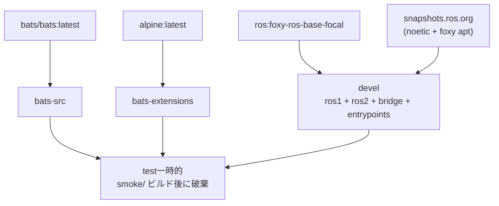

# ROS 1 Bridge Docker Environment

**[English](../README.md)** | **[繁體中文](README.zh-TW.md)** | **[简体中文](README.zh-CN.md)** | **[日本語](README.ja.md)**

> **TL;DR** — `ros:foxy-ros-base-focal` に ROS 1 snapshot apt repo を足して自ビルドした ROS 1/2 ブリッジコンテナ。`parameter_bridge` で ROS 1 (Noetic) と ROS 2 (Foxy) の topic をブリッジ。base image は multi-arch のため Jetson (arm64) に対応。
>
> ```bash
> ./build.sh && ./run.sh
> ```

---

## 目次

- [特徴](#特徴)
- [クイックスタート](#クイックスタート)
- [使い方](#使い方)
- [ブリッジ設定](#ブリッジ設定)
- [アーキテクチャ](#アーキテクチャ)
- [ディレクトリ構成](#ディレクトリ構成)

---

## 特徴

- **自ビルド bridge イメージ**：`ros:foxy-ros-base-focal` をベースに、ROS 1 snapshot apt repo から ROS 1 Noetic と ROS 2 Foxy を併せてインストール
- **Jetson (arm64) 対応**：base image が multi-arch（amd64 のみの `osrf/ros:foxy-ros1-bridge` と異なる）
- **Parameter bridge**：YAML 設定で topic ブリッジを構成可能
- **デュアル entrypoint**：`/entrypoint.sh`（両 ROS を source + `rosparam load /bridge.yaml`）と `/ros_entrypoint.sh`（ROS 環境のみ、osrf 慣習互換）
- **Smoke Test**：Bats テストで両 ROS 環境と bridge の可用性を検証
- **Docker Compose**：`compose.yaml` 一つでビルドと実行を管理
- **サンプル設定**：scan と camera のブリッジ設定ファイルを同梱

## クイックスタート

```bash
# 1. ビルド
./build.sh

# 2. 実行（ROS master が起動済みであること）
./run.sh

# 3. 起動中のコンテナに接続
./exec.sh
```

## 使い方

### ビルド

```bash
./build.sh                       # devel をビルド（デフォルト）
./build.sh test                  # smoke test 付きビルド

docker compose build devel     # 同等のコマンド
```

### 実行

```bash
./run.sh                         # デフォルトの bridge 設定で実行

# カスタム bridge モードを使用
docker compose run --rm devel ros2 run ros1_bridge dynamic_bridge
```

### 起動中のコンテナに接続

```bash
./exec.sh
./exec.sh bash
```

## ブリッジ設定

デフォルトの bridge 設定は `bridge.yaml`。追加設定ファイルは `config/` ディレクトリ内：

| ファイル | 説明 |
|----------|------|
| `bridge.yaml` | デフォルト設定（LaserScan `/scan`） |
| `config/scan_bridge.yaml` | LaserScan bridge |
| `config/release_bridge.yaml` | Camera + depth topics bridge |

異なる設定で再ビルド：

```bash
docker compose build --build-arg BRIDGE_FILE=config/release_bridge.yaml devel
```

### YAML フォーマット

```yaml
topics:
  - topic: /scan
    type: sensor_msgs/msg/LaserScan
    queue_size: 10
```

## アーキテクチャ



## Smoke Tests

詳細は [TEST.md](test/TEST.md) を参照。

## ディレクトリ構成

```text
ros1_bridge/
├── compose.yaml                 # Docker Compose 定義
├── Dockerfile                   # マルチステージビルド（devel + test）
├── build.sh -> template/build.sh    # Symlink
├── run.sh -> template/run.sh        # Symlink
├── exec.sh -> template/exec.sh      # Symlink
├── stop.sh -> template/stop.sh      # Symlink
├── Makefile -> template/Makefile    # Symlink
├── .template_version            # Template subtree バージョン（v0.4.1）
├── template/                    # 共有スクリプト、テスト、CI（git subtree）
├── script/
│   ├── entrypoint.sh            # ROS 1 + ROS 2 を source、bridge 設定を読み込み
│   └── ros_entrypoint.sh        # ROS 環境のみ source（osrf 互換）
├── bridge.yaml                  # デフォルト bridge 設定
├── config/                      # 追加 bridge 設定
│   ├── scan_bridge.yaml         # LaserScan bridge
│   └── release_bridge.yaml      # Camera + depth bridge
├── doc/                         # 翻訳版 README
│   ├── README.zh-TW.md          # 繁体字中国語
│   ├── README.zh-CN.md          # 簡体字中国語
│   └── README.ja.md             # 日本語
├── .github/workflows/
│   └── main.yaml                # CI/CD（template reusable workflows を呼び出し）
└── test/smoke/                  # Bats 環境テスト（repo 固有）
    └── ros_env.bats
```
