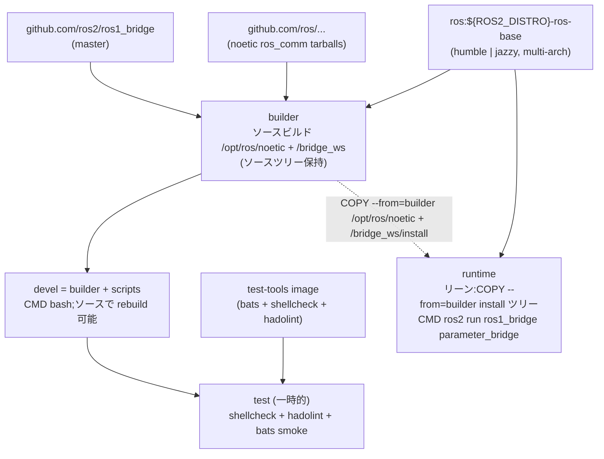

# ROS 1 Bridge Docker Environment

**[English](../README.md)** | **[繁體中文](README.zh-TW.md)** | **[简体中文](README.zh-CN.md)** | **[日本語](README.ja.md)**

> **TL;DR** — ROS 1/2 ブリッジコンテナ。**Humble + Jazzy のデュアルターゲット**で、ベースイメージは `ros:${ROS2_DISTRO}-ros-base`、**Noetic `ros_comm` をソースビルド**＋**`ros1_bridge` をソースビルド**します（Foxy / Noetic apt は focal 以外で提供されていないため）。`ARG ROS2_DISTRO=humble|jazzy` でターゲットを選択。base image は multi-arch のため Jetson (arm64) に対応。詳細な migration rationale は [#53](https://github.com/ycpss91255-docker/ros1_bridge/issues/53) を参照。
>
> ```bash
> ./build.sh && ./run.sh           # デフォルト ROS2_DISTRO=humble（setup.conf [build] arg_4 で設定）
> ```

---

## 目次

- [特徴](#特徴)
- [クイックスタート](#クイックスタート)
- [ROS 2 distro の切り替え](#ros-2-distro-の切り替え)
- [使い方](#使い方)
- [ブリッジ設定](#ブリッジ設定)
- [Demo](#demo)
- [アーキテクチャ](#アーキテクチャ)
- [ディレクトリ構成](#ディレクトリ構成)

---

## 特徴

- **ROS 1 + bridge をソースビルド**：`ros:${ROS2_DISTRO}-ros-base` をベースに、Noetic `ros_comm` を `rosinstall_generator` で tarball から `/opt/ros/noetic/` にビルド、`ros1_bridge` を `ros2/ros1_bridge` master から `/bridge_ws/install/` にビルドします。Humble (jammy) と Jazzy (noble) の両方に対応、`ARG ROS2_DISTRO` の matrix で切り替え。
- **なぜソースビルドか**：Open Robotics は focal 以外で `ros-noetic-*` debs を公開しておらず、`ros-jazzy-ros1-bridge` も存在しません。`humble|jazzy ↔ foxy ↔ noetic` の chained DDS による回避策は、Fast-DDS のメジャーバージョン差 + REP-2011 type-hash 不一致により実測で破綻しました。詳細は [#53](https://github.com/ycpss91255-docker/ros1_bridge/issues/53) を参照。
- **Jetson (arm64) 対応**：base image が multi-arch（amd64 のみの `osrf/ros:foxy-ros1-bridge` と異なる）
- **Parameter bridge**：YAML 設定で topic ブリッジを構成可能
- **builder / devel / runtime の分離**:`builder` stage は Noetic + `ros1_bridge` をソースビルドし**ソースツリーを保持**(`/noetic_ws/src/` と `/bridge_ws/src/ros1_bridge/`);`devel` (`FROM builder`) はソースを継承しコンテナ内での rebuild / debug を可能に、デフォルトでシェル起動 (`CMD bash`);`runtime` (`FROM ${IMAGE}`、**devel を継承しない**) はリーン版で `COPY --from=builder` で install ツリーのみ取り込み、`parameter_bridge` を `/bridge.yaml` 基準で自動起動
- **Docker Compose**：`compose.yaml` 一つでビルドと実行を管理
- **サンプル設定**：scan と camera のブリッジ設定ファイルを同梱

## クイックスタート

```bash
# 1. ビルド
./build.sh

# 2. 実行（ROS master が起動済みであること）
./run.sh

# 3. 起動中のコンテナに接続
./exec.sh
```

## ROS 2 distro の切り替え

デフォルトは `humble`(jammy 22.04)。`jazzy`(noble 24.04)に切り替えるには:

**方式 1(推奨):`setup.conf` を編集**。`[build]` セクションの `arg_4` を変更:

```ini
[build]
arg_4 = ROS2_DISTRO=jazzy
```

その後 rebuild。`setup.sh` は `setup.conf` を hash して `.env` の `SETUP_CONF_HASH`
に書き込むため、`./build.sh` / `./run.sh` は変更を自動検出して `.env` + `compose.yaml`
を再生成します。image tag(`yunchien/ros1_bridge:devel` 等)は distro を跨いで
変わらず、切り替えはその場で rebuild されます。

```bash
./build.sh           # setup.conf から新しい ROS2_DISTRO を取得
./run.sh
```

**方式 2:単発の `--build-arg`(直接 docker build)**。`./build.sh` を経由せず、
`.env` / `compose.yaml` も更新しません:

```bash
docker build --target devel --build-arg ROS2_DISTRO=jazzy -t ros1_bridge:devel .
```

CI は `.github/workflows/main.yaml` の matrix で両 distro を並列 build します。
setup.conf の変更はローカル build のみに影響し、`ghcr.io/ycpss91255-docker/ros1_bridge-{humble,jazzy}`
へ公開される image は setup.conf に依らず常に matrix が決定します。

## 使い方

### ビルド

```bash
./build.sh                       # devel をビルド（デフォルト）
./build.sh test                  # smoke test 付きビルド

docker compose build devel     # 同等のコマンド
```

### 実行

stage target に応じて 2 モード：

```bash
./run.sh                         # devel：対話 bash シェル、bridge は自動起動しない
./run.sh -d                      # devel をバックグラウンド起動、./exec.sh で接続
```

`runtime`（bridge 自動起動）は現状 `docker run` を直接呼ぶ必要があります
—— 自動生成される `compose.yaml` はまだ `runtime` サービスを emit しません
（template 側で追跡中）：

```bash
docker build --target runtime -t ros1_bridge:runtime .
docker run --rm --network=host ros1_bridge:runtime
# entrypoint が両 ROS を source、rosparam load /bridge.yaml、
# その後 `ros2 run ros1_bridge parameter_bridge` を exec します。
# 前提：host network 上に roscore が起動していること。
```

### 起動中のコンテナに接続

```bash
./exec.sh
./exec.sh bash
```

## ブリッジ設定

`bridge.yaml` は **バージョン管理されません** — `config/` から設定を選び、
ビルド前に symlink を張ってください：

```bash
ln -sf config/scan_bridge.yaml bridge.yaml          # LaserScan
ln -sf config/release_bridge.yaml bridge.yaml       # RealSense camera + depth
ln -sf config/demo_bridge.yaml bridge.yaml          # std_msgs/String chatter デモ
ln -sf config/demo_services_1to2.yaml bridge.yaml   # ROS 1 → ROS 2 サービスデモ
ln -sf config/demo_services_2to1.yaml bridge.yaml   # ROS 2 → ROS 1 サービスデモ
```

| 設定ファイル | ブリッジ内容 |
|--------------|--------------|
| `config/scan_bridge.yaml` | LaserScan `/scan`（sensor-data QoS） |
| `config/release_bridge.yaml` | RealSense camera + depth topics |
| `config/demo_bridge.yaml` | 双方向 `std_msgs/String` chatter（`ros{1,2}_server.sh` デモ用） |
| `config/demo_services_1to2.yaml` | ROS 1 サービスを ROS 2 に公開（`/add_two_ints`、`/static_map`） |
| `config/demo_services_2to1.yaml` | ROS 2 サービスを ROS 1 に公開（`/get_parameters`） |

> 二つのサービスデモが要求する type conversion は、ここでソースビルド
> された `ros1_bridge` にも組み込まれていません。`colcon build`
> ステップで対応する ROS 1 / ROS 2 パッケージを追加してイメージを
> 再ビルドしない限り、runtime で `no conversion for type ...` が
> 表示されます。

symlink を変更したくない場合はビルド時に上書き可能：

```bash
docker compose build --build-arg BRIDGE_FILE=config/release_bridge.yaml devel
```

### YAML フォーマット

Topic の `type` は ROS 2 形式 `<package>/msg/<MsgName>`、service の `type`
は ROS 1 形式 `<package>/<SrvName>` を使用します（この非対称は
`parameter_bridge` の仕様です）。Topic ごとの QoS は `qos` キーで指定でき、
調整可能な全項目は [`config/`](../config/) 配下の各設定ファイルを参照してください。

```yaml
topics:
  - topic: /scan
    type: sensor_msgs/msg/LaserScan
    queue_size: 10
    qos:
      history: keep_last
      depth: 5
      reliability: best_effort
      durability: volatile

services_1_to_2:
  - service: /add_two_ints
    type: example_interfaces/AddTwoInts

services_2_to_1:
  - service: /get_parameters
    type: rcl_interfaces/GetParameters
```

## Demo

2 つの terminal でエンドツーエンドの bridge デモを実行します。
メッセージ型は `std_msgs/String`。パターンは対称で、**server**
terminal が `roscore` + `parameter_bridge`(ビルド時にイメージへ
焼き込まれた `/demo_bridge.yaml` を読み込む)を起動し、**client**
terminal は subscribe するだけです。

| Demo | Terminal 1 (server) | Terminal 2 (client) |
|------|---------------------|---------------------|
| A — ROS 1 → ROS 2 | `./exec.sh /ros1_server.sh` | `./exec.sh /ros2_client.sh` |
| B — ROS 2 → ROS 1 | `./exec.sh /ros2_server.sh` | `./exec.sh /ros1_client.sh` |

実際の手順(コンテナを `./run.sh -d` で起動済みとして):

```bash
# Terminal 1 (server) — どちらかを選択
./exec.sh /ros1_server.sh    # Demo A
./exec.sh /ros2_server.sh    # Demo B

# Terminal 2 (client) — 対応するもう一方
./exec.sh /ros2_client.sh    # Demo A
./exec.sh /ros1_client.sh    # Demo B
```

Server スクリプトは各ステップを明示的にログ出力します
(`[ros1_server] step N/5: ...`)。`roscore` と `parameter_bridge` が
いつ準備完了になったかが一目で分かります。Publish するメッセージは
`MESSAGE` 環境変数で上書き可能です:

```bash
./exec.sh env MESSAGE="hi from ROS 1" /ros1_server.sh
```

Server terminal で `Ctrl+C` を押すと `parameter_bridge` と `roscore`
を停止し、client terminal も EOF になります。

## アーキテクチャ



## Smoke Tests

詳細は [TEST.md](test/TEST.md) を参照。

## ディレクトリ構成

```text
ros1_bridge/
├── compose.yaml                 # Docker Compose 定義
├── Dockerfile                   # マルチステージビルド（devel + runtime + test）；source-builds Noetic + ros1_bridge
├── setup.conf                   # Repo override；[build] arg_4=ROS2_DISTRO で humble|jazzy を選択
├── build.sh -> template/build.sh    # Symlink
├── run.sh -> template/run.sh        # Symlink
├── exec.sh -> template/exec.sh      # Symlink
├── stop.sh -> template/stop.sh      # Symlink
├── Makefile -> template/Makefile    # Symlink
├── .template_version            # Template subtree バージョン（v0.4.1）
├── template/                    # 共有スクリプト、テスト、CI（git subtree）
├── script/
│   ├── entrypoint.sh            # ROS 1 + ROS 2 を source、bridge 設定を読み込み
│   ├── ros_entrypoint.sh        # ROS 環境のみ source（osrf 互換）
│   ├── ros1_server.sh           # Demo A publisher（roscore + bridge を自起動）
│   ├── ros1_client.sh           # Demo B subscriber
│   ├── ros2_server.sh           # Demo B publisher（roscore + bridge を自起動）
│   └── ros2_client.sh           # Demo A subscriber
├── bridge.yaml                  # config/*.yaml への symlink（gitignored、利用者が選択）
├── config/                      # Bridge 設定ファイル
│   ├── scan_bridge.yaml         # LaserScan bridge
│   ├── release_bridge.yaml      # Camera + depth bridge
│   ├── demo_bridge.yaml         # 双方向 std_msgs/String chatter
│   ├── demo_services_1to2.yaml  # ROS 1 → ROS 2 サービスデモ
│   └── demo_services_2to1.yaml  # ROS 2 → ROS 1 サービスデモ
├── doc/                         # 翻訳版 README
│   ├── README.zh-TW.md          # 繁体字中国語
│   ├── README.zh-CN.md          # 簡体字中国語
│   └── README.ja.md             # 日本語
├── .github/workflows/
│   └── main.yaml                # CI/CD（template reusable workflows を呼び出し）
└── test/smoke/                  # Bats 環境テスト（repo 固有）
    └── ros_env.bats
```
