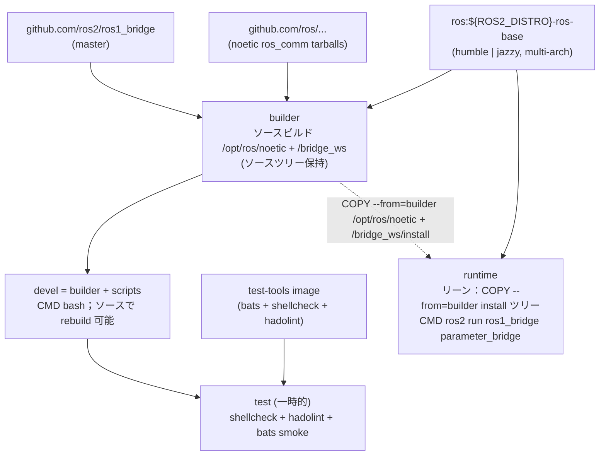

# ROS 1 Bridge Docker Environment

[](https://github.com/ycpss91255-docker/ros1_bridge/actions/workflows/main.yaml) [](../LICENSE)

ROS 1/2 ブリッジコンテナ、**Humble + Jazzy のデュアルターゲット** — `ros:${ROS2_DISTRO}-ros-base` をベースに Noetic `ros_comm` と `ros1_bridge` をソースビルド。Multi-arch（amd64 / arm64）。

**[English](../README.md)** | **[繁體中文](README.zh-TW.md)** | **[简体中文](README.zh-CN.md)** | **[日本語](README.ja.md)**

---

## 目次

- [TL;DR](#tldr)
- [Overview](#overview)
- [特徴](#特徴)
- [クイックスタート](#クイックスタート)
- [ROS 2 distro の切り替え](#ros-2-distro-の切り替え)
- [使い方](#使い方)
- [ブリッジ設定](#ブリッジ設定)
- [Demo](#demo)
- [アーキテクチャ](#アーキテクチャ)
- [Smoke Tests](#smoke-tests)
- [ディレクトリ構成](#ディレクトリ構成)

---

## TL;DR

```bash
ln -sf config/ros1_bridge/demo_bridge.yaml bridge.yaml   # ブリッジ設定を選択（gitignored、clone 単位）。スキップしても demo にフォールバック。
make build && make run                       # デフォルト ROS2_DISTRO=humble（setup.conf [build] arg_4 で設定）
```

`ln -sf` ステップをスキップしても問題ありません — Dockerfile が
自動的に `config/ros1_bridge/demo_bridge.yaml` にフォールバックします
（[#65](https://github.com/ycpss91255-docker/ros1_bridge/issues/65) 修正）。
利用可能な設定一覧は [ブリッジ設定](#ブリッジ設定) を参照。

## Overview

`osrf/ros:foxy-ros1-bridge` の従来の配布経路は現代の host 上では
すでに機能しません。Open Robotics は focal 以外で `ros-noetic-*`
debs を公開しておらず、`ros-jazzy-ros1-bridge` も存在しません。
`humble|jazzy ↔ foxy ↔ noetic` の chained DDS による回避策は、
Fast-DDS のメジャーバージョン差 + REP-2011 type-hash 不一致により
実測で破綻しました。本 repo はこれを単一の Dockerfile で置き換え、
`ros:${ROS2_DISTRO}-ros-base` の上に Noetic `ros_comm` +
`ros1_bridge` をソースビルドし、`ARG ROS2_DISTRO=humble|jazzy` で
ターゲットを選択、multi-arch（amd64 + arm64、Jetson 含む）対応。
詳細な migration rationale は
[#53](https://github.com/ycpss91255-docker/ros1_bridge/issues/53) を参照。

## 特徴

- **ROS 1 + bridge をソースビルド**：`ros:${ROS2_DISTRO}-ros-base` をベースに、Noetic `ros_comm` を `rosinstall_generator` で tarball から `/opt/ros/noetic/` にビルド、`ros1_bridge` を `ros2/ros1_bridge` master から `/bridge_ws/install/` にビルドします。Humble (jammy) と Jazzy (noble) の両方に対応、`ARG ROS2_DISTRO` の matrix で切り替え。
- **Jetson (arm64) 対応**：base image が multi-arch（amd64 のみの `osrf/ros:foxy-ros1-bridge` と異なる）
- **Parameter bridge**：YAML 設定で topic ブリッジを構成可能
- **builder / devel / runtime の分離**：`builder` stage は Noetic + `ros1_bridge` をソースビルドし**ソースツリーを保持**（`/noetic_ws/src/` と `/bridge_ws/src/ros1_bridge/`）；`devel`（`FROM builder`）はソースを継承しコンテナ内での rebuild / debug を可能に、デフォルトでシェル起動（`CMD bash`）；`runtime`（`FROM ${IMAGE}`、**devel を継承しない**）はリーン版で `COPY --from=builder` で install ツリーのみ取り込み、`parameter_bridge` を `/bridge.yaml` 基準で自動起動
- **Docker Compose**：`compose.yaml` 一つでビルドと実行を管理
- **サンプル設定**：scan と camera のブリッジ設定ファイルを同梱

## クイックスタート

```bash
# 0.（任意）ブリッジ設定を選択。スキップした場合は
#    config/ros1_bridge/demo_bridge.yaml にフォールバック — 下記「ブリッジ設定」参照。
ln -sf config/ros1_bridge/demo_bridge.yaml bridge.yaml

# 1. ビルド
make build

# 2. 実行（ROS master が起動済みであること）
make run

# 3. 起動中のコンテナに接続
make exec
```

## ROS 2 distro の切り替え

デフォルトは `humble`（jammy 22.04）。`jazzy`（noble 24.04）に切り替えるには、
CLI 経由で `setup.conf [build] arg_4` を更新します：

```bash
make setup -- set build.arg_4 ROS2_DISTRO=jazzy
make build && make run
```

`set` は値を `setup.conf [build] arg_4` に書き込みます（section / key が
無ければ作成）。`make build` は `.env` 内の `setup.conf` hash で変更を
検知し、`.env` + `compose.yaml` を自動再生成して rebuild します。image
tag（`yunchien/ros1_bridge:devel` 等）は distro を跨いで変わらず、
切り替えはその場で rebuild されます。

対話的に編集する場合は `make setup-tui`（dialog / whiptail フロントエンド）
を実行し、TUI で `[build] arg_4` を変更します。

CI は `.github/workflows/main.yaml` の matrix で両 distro を並列 build します。
setup.conf の変更はローカル build のみに影響し、`ghcr.io/ycpss91255-docker/ros1_bridge-{humble,jazzy}`
へ公開される image は setup.conf に依らず常に matrix が決定します。

## 使い方

### ビルド

```bash
make build                       # devel をビルド（デフォルト）
make build test                  # smoke test 付きビルド
make build -- -t runtime         # 軽量な runtime image をビルド
```

### 実行

stage target に応じて 2 モード：

```bash
make run                         # devel：対話 bash シェル、bridge は自動起動しない
make run -- -d                   # devel をバックグラウンド起動、make exec で接続
```

`runtime`（Dockerfile `CMD` 経由で bridge 自動起動）：

```bash
make run -- -t runtime           # runtime service を起動。entrypoint が両 ROS を
                                 # source、rosparam load /bridge.yaml、その後
                                 # `ros2 run ros1_bridge parameter_bridge` を exec
                                 # します。前提：host network 上に roscore が
                                 # 起動していること。
```

### 起動中のコンテナに接続

```bash
make exec
make exec bash
```

## ブリッジ設定

`bridge.yaml` は **バージョン管理されません** — オペレーターが `config/`
から選んで張る per-clone symlink です。ビルド時に symlink が存在しない
または壊れている場合、Dockerfile は `config/ros1_bridge/demo_bridge.yaml` に自動で
フォールバックします（[#65](https://github.com/ycpss91255-docker/ros1_bridge/issues/65) 修正）。
したがって fresh clone でもそのままビルド可能です。別の設定を選ぶには：

```bash
ln -sf config/ros1_bridge/scan_bridge.yaml bridge.yaml          # LaserScan
ln -sf config/ros1_bridge/release_bridge.yaml bridge.yaml       # RealSense camera + depth
ln -sf config/ros1_bridge/demo_bridge.yaml bridge.yaml          # std_msgs/String chatter デモ（フォールバックの既定でもある）
ln -sf config/ros1_bridge/demo_services_1to2.yaml bridge.yaml   # ROS 1 → ROS 2 サービスデモ
ln -sf config/ros1_bridge/demo_services_2to1.yaml bridge.yaml   # ROS 2 → ROS 1 サービスデモ
```

| 設定ファイル | ブリッジ内容 |
|--------------|--------------|
| `config/ros1_bridge/scan_bridge.yaml` | LaserScan `/scan`（sensor-data QoS） |
| `config/ros1_bridge/release_bridge.yaml` | RealSense camera + depth topics |
| `config/ros1_bridge/demo_bridge.yaml` | 双方向 `std_msgs/String` chatter（`ros{1,2}_server.sh` デモ用） |
| `config/ros1_bridge/demo_services_1to2.yaml` | ROS 1 サービスを ROS 2 に公開（`/add_two_ints`、`/static_map`） |
| `config/ros1_bridge/demo_services_2to1.yaml` | ROS 2 サービスを ROS 1 に公開（`/get_parameters`） |

> 二つのサービスデモが要求する type conversion は、ここでソースビルド
> された `ros1_bridge` にも組み込まれていません。`colcon build`
> ステップで対応する ROS 1 / ROS 2 パッケージを追加してイメージを
> 再ビルドしない限り、runtime で `no conversion for type ...` が
> 表示されます。

### YAML フォーマット

Topic の `type` は ROS 2 形式 `<package>/msg/<MsgName>`、service の `type`
は ROS 1 形式 `<package>/<SrvName>` を使用します（この非対称は
`parameter_bridge` の仕様です）。Topic ごとの QoS は `qos` キーで指定でき、
調整可能な全項目は [`config/`](../config/) 配下の各設定ファイルを参照してください。

```yaml
topics:
  - topic: /scan
    type: sensor_msgs/msg/LaserScan
    queue_size: 10
    qos:
      history: keep_last
      depth: 5
      reliability: best_effort
      durability: volatile

services_1_to_2:
  - service: /add_two_ints
    type: example_interfaces/AddTwoInts

services_2_to_1:
  - service: /get_parameters
    type: rcl_interfaces/GetParameters
```

## Demo

2 つの terminal でエンドツーエンドの bridge デモを実行します。
メッセージ型は `std_msgs/String`。パターンは対称で、**server**
terminal が `roscore` + `parameter_bridge`（ビルド時にイメージへ
焼き込まれた `/demo_bridge.yaml` を読み込む）を起動し、**client**
terminal は subscribe するだけです。

| Demo | Terminal 1 (server) | Terminal 2 (client) |
|------|---------------------|---------------------|
| A — ROS 1 → ROS 2 | `make exec -- /root/demo/ros1_server.sh` | `make exec -- /root/demo/ros2_client.sh` |
| B — ROS 2 → ROS 1 | `make exec -- /root/demo/ros2_server.sh` | `make exec -- /root/demo/ros1_client.sh` |

実際の手順（コンテナを `make run -- -d` で起動済みとして）：

```bash
# Terminal 1 (server) — どちらかを選択
make exec -- /root/demo/ros1_server.sh    # Demo A
make exec -- /root/demo/ros2_server.sh    # Demo B

# Terminal 2 (client) — 対応するもう一方
make exec -- /root/demo/ros2_client.sh    # Demo A
make exec -- /root/demo/ros1_client.sh    # Demo B
```

Server スクリプトは各ステップを明示的にログ出力します
（`[ros1_server] step N/5: ...`）。`roscore` と `parameter_bridge` が
いつ準備完了になったかが一目で分かります。Publish するメッセージは
`MESSAGE` 環境変数で上書き可能です：

```bash
make exec -- env MESSAGE="hi from ROS 1" /root/demo/ros1_server.sh
```

Server terminal で `Ctrl+C` を押すと `parameter_bridge` と `roscore`
を停止し、client terminal も EOF になります。

## アーキテクチャ



## Smoke Tests

詳細は [TEST.md](test/TEST.md) を参照。

## ディレクトリ構成

```text
ros1_bridge/
├── compose.yaml                 # Docker Compose 定義
├── Dockerfile                   # マルチステージビルド（devel + runtime + test）；source-builds Noetic + ros1_bridge
├── setup.conf                   # Repo override；[build] arg_4=ROS2_DISTRO で humble|jazzy を選択
├── Makefile -> .base/script/docker/Makefile     # Symlink
├── .base/                    # 共有スクリプト、テスト、CI（git subtree；バージョンは .base/.version）
├── script/
│   ├── build.sh -> ../.base/script/docker/build.sh    # Wrapper symlinks
│   ├── run.sh -> ../.base/script/docker/run.sh
│   ├── exec.sh -> ../.base/script/docker/exec.sh
│   ├── stop.sh -> ../.base/script/docker/stop.sh
│   ├── setup.sh -> ../.base/script/docker/setup.sh
│   ├── setup_tui.sh -> ../.base/script/docker/setup_tui.sh
│   ├── prune.sh -> ../.base/script/docker/prune.sh
│   ├── entrypoint.sh            # ROS 1 + ROS 2 を source、bridge 設定を読み込み
│   ├── ros_entrypoint.sh        # ROS 環境のみ source（osrf 互換）
│   ├── ros1_server.sh           # Demo A publisher（roscore + bridge を自起動）
│   ├── ros1_client.sh           # Demo B subscriber
│   ├── ros2_server.sh           # Demo B publisher（roscore + bridge を自起動）
│   └── ros2_client.sh           # Demo A subscriber
├── bridge.yaml                  # config/ros1_bridge/*.yaml への symlink（gitignored、利用者が選択）
├── config/
│   └── ros1_bridge/             # Bridge 設定ファイル（namespaced；config/ は template overlay 用に温存）
│       ├── scan_bridge.yaml         # LaserScan bridge
│       ├── release_bridge.yaml      # Camera + depth bridge
│       ├── demo_bridge.yaml         # 双方向 std_msgs/String chatter（フォールバックの既定でもある）
│       ├── demo_services_1to2.yaml  # ROS 1 → ROS 2 サービスデモ
│       └── demo_services_2to1.yaml  # ROS 2 → ROS 1 サービスデモ
├── doc/                         # 翻訳版 README
│   ├── README.zh-TW.md          # 繁体字中国語
│   ├── README.zh-CN.md          # 簡体字中国語
│   └── README.ja.md             # 日本語
├── .github/workflows/
│   └── main.yaml                # CI/CD（template reusable workflows を呼び出し）
└── test/smoke/                  # Bats 環境テスト（repo 固有）
    └── ros_env.bats
```
