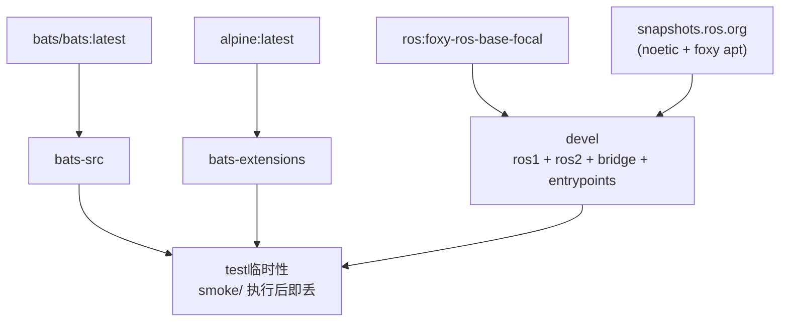

# ROS 1 Bridge Docker Environment

**[English](../README.md)** | **[繁體中文](README.zh-TW.md)** | **[简体中文](README.zh-CN.md)** | **[日本語](README.ja.md)**

> **TL;DR** — 以 `ros:foxy-ros-base-focal` 加 ROS 1 snapshot apt repo 自建的 ROS 1/2 bridge 容器。通过 `parameter_bridge` 桥接 ROS 1 (Noetic) 与 ROS 2 (Foxy) topics。base image 为 multi-arch，支持 Jetson (arm64)。
>
> ```bash
> ./build.sh && ./run.sh
> ```

---

## 目录

- [特性](#特性)
- [快速开始](#快速开始)
- [使用方式](#使用方式)
- [Bridge 设置](#bridge-设置)
- [架构](#架构)
- [目录结构](#目录结构)

---

## 特性

- **自建 bridge 镜像**：以 `ros:foxy-ros-base-focal` 为底，通过 ROS 1 snapshot apt repo 并装 ROS 1 Noetic 与 ROS 2 Foxy
- **Jetson (arm64) 支持**：base image 为 multi-arch（不同于仅 amd64 的 `osrf/ros:foxy-ros1-bridge`）
- **Parameter bridge**：通过 YAML 设置可配置的 topic 桥接
- **双 entrypoint**：`/entrypoint.sh`（source 两个 ROS + `rosparam load /bridge.yaml`）与 `/ros_entrypoint.sh`（纯 ROS 环境，兼容 osrf 惯例）
- **Smoke Test**：Bats 测试验证两个 ROS 环境及 bridge 可用性
- **Docker Compose**：一个 `compose.yaml` 管理构建与执行
- **示例设置**：内含 scan 和 camera bridge 设置文件

## 快速开始

```bash
# 1. 构建
./build.sh

# 2. 执行（需要 ROS master 已启动）
./run.sh

# 3. 进入已启动的容器
./exec.sh
```

## 使用方式

### 构建

```bash
./build.sh                       # 构建 devel（默认）
./build.sh test                  # 构建含 smoke test

docker compose build devel     # 等效命令
```

### 执行

```bash
./run.sh                         # 以默认 bridge 设置执行

# 或使用自定义 bridge 模式
docker compose run --rm devel ros2 run ros1_bridge dynamic_bridge
```

### 进入已启动的容器

```bash
./exec.sh
./exec.sh bash
```

## Bridge 设置

默认 bridge 设置为 `bridge.yaml`。额外设置文件在 `config/` 目录：

| 文件 | 说明 |
|------|------|
| `bridge.yaml` | 默认设置（LaserScan `/scan`） |
| `config/scan_bridge.yaml` | LaserScan bridge |
| `config/release_bridge.yaml` | Camera + depth topics bridge |

使用不同设置重新构建：

```bash
docker compose build --build-arg BRIDGE_FILE=config/release_bridge.yaml devel
```

### YAML 格式

```yaml
topics:
  - topic: /scan
    type: sensor_msgs/msg/LaserScan
    queue_size: 10
```

## 架构



## Smoke Tests

详见 [TEST.md](test/TEST.md)。

## 目录结构

```text
ros1_bridge/
├── compose.yaml                 # Docker Compose 定义
├── Dockerfile                   # 多阶段构建（devel + test）
├── build.sh -> template/build.sh    # Symlink
├── run.sh -> template/run.sh        # Symlink
├── exec.sh -> template/exec.sh      # Symlink
├── stop.sh -> template/stop.sh      # Symlink
├── Makefile -> template/Makefile    # Symlink
├── .template_version            # Template subtree 版本（v0.4.1）
├── template/                    # 共用脚本、测试、CI（git subtree）
├── script/
│   ├── entrypoint.sh            # Source ROS 1 + ROS 2，载入 bridge 设置
│   └── ros_entrypoint.sh        # 仅 source ROS 环境（兼容 osrf）
├── bridge.yaml                  # 默认 bridge 设置
├── config/                      # 额外 bridge 设置
│   ├── scan_bridge.yaml         # LaserScan bridge
│   └── release_bridge.yaml      # Camera + depth bridge
├── doc/                         # 翻译版 README
│   ├── README.zh-TW.md          # 繁体中文
│   ├── README.zh-CN.md          # 简体中文
│   └── README.ja.md             # 日文
├── .github/workflows/
│   └── main.yaml                # CI/CD（调用 template reusable workflows）
└── test/smoke/                  # Bats 环境测试（repo 专属）
    └── ros_env.bats
```
