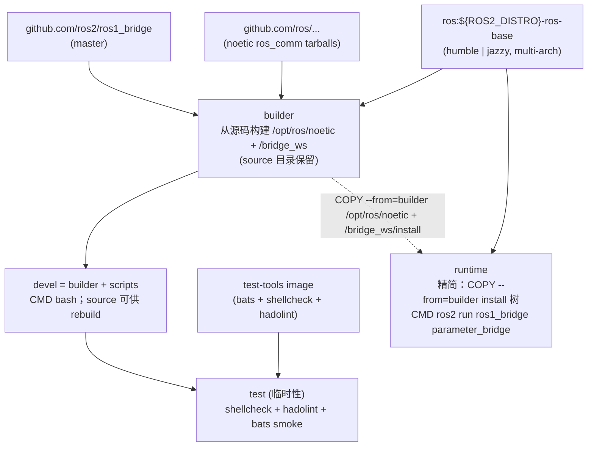

# ROS 1 Bridge Docker Environment

[](https://github.com/ycpss91255-docker/ros1_bridge/actions/workflows/main.yaml) [](../LICENSE)

ROS 1/2 bridge 容器，**Humble + Jazzy 双 target** — `ros:${ROS2_DISTRO}-ros-base` 加 source-build Noetic `ros_comm` 与 `ros1_bridge`。Multi-arch（amd64 / arm64）。

**[English](../README.md)** | **[繁體中文](README.zh-TW.md)** | **[简体中文](README.zh-CN.md)** | **[日本語](README.ja.md)**

---

## 目录

- [TL;DR](#tldr)
- [Overview](#overview)
- [特性](#特性)
- [快速开始](#快速开始)
- [切换 ROS 2 distro](#切换-ros-2-distro)
- [使用方式](#使用方式)
- [Bridge 设置](#bridge-设置)
- [Demo](#demo)
- [架构](#架构)
- [Smoke Tests](#smoke-tests)
- [目录结构](#目录结构)

---

## TL;DR

### Demo（端到端 ROS 1 / ROS 2 bridging）

```bash
make build && make run -- -d

# Terminal 1 — roscore + bridge + ROS 1 publisher (10 Hz)
make exec -- /root/demo/ros1_server.sh

# Terminal 2 — ROS 2 subscriber 接收 bridged 消息
make exec -- /root/demo/ros2_client.sh
```

### Production（headless bridge daemon）

```bash
# 前置条件：host network 上必须已有 roscore 在运行
make build && make run -- -t runtime -d

# 检查 bridge 状态
docker logs -f $(docker ps -qf name=ros1_bridge-runtime)
```

> 默认 ROS2\_DISTRO=humble（在 `setup.conf [build] arg_4` 设置）。
> 未创建 `bridge.yaml` symlink 时自动 fallback 到
> `config/ros1_bridge/demo_bridge.yaml` — 完整可选配置见
> [Bridge 设置](#bridge-设置)。

## Overview

`osrf/ros:foxy-ros1-bridge` 的传统发行路径在现代 host 上已经行不通：
Open Robotics 从未在 focal 之外发布 `ros-noetic-*` debs，且
`ros-jazzy-ros1-bridge` 也不存在。`humble|jazzy ↔ foxy ↔ noetic`
的 chained DDS 变通方案实测因 Fast-DDS 大版本差异 + REP-2011 type-hash
不匹配而失败。本 repo 改成单一 Dockerfile，在
`ros:${ROS2_DISTRO}-ros-base` 之上 source-build Noetic `ros_comm` +
`ros1_bridge`，通过 `ARG ROS2_DISTRO=humble|jazzy` 选择目标，
multi-arch（amd64 + arm64 含 Jetson）。完整 migration rationale 见
[#53](https://github.com/ycpss91255-docker/ros1_bridge/issues/53)。

## 特性

- **ROS 1 + bridge 从源码构建**：`ros:${ROS2_DISTRO}-ros-base` 为 base；Noetic `ros_comm` 通过 `rosinstall_generator` 抓 tarball 构建到 `/opt/ros/noetic/`；`ros1_bridge` 从 `ros2/ros1_bridge` master 构建到 `/bridge_ws/install/`。同时支持 Humble (jammy) 与 Jazzy (noble)，通过 `ARG ROS2_DISTRO` matrix 选择。
- **Jetson (arm64) 支持**：base image 为 multi-arch（不同于仅 amd64 的 `osrf/ros:foxy-ros1-bridge`）
- **Parameter bridge**：通过 YAML 设置可配置的 topic 桥接
- **builder / devel / runtime 分离**：`builder` stage 从源码构建 Noetic + `ros1_bridge` 并**保留 source 目录**（`/noetic_ws/src/` 和 `/bridge_ws/src/ros1_bridge/`）；`devel`（`FROM builder`）继承 source 供容器内 rebuild / debug，默认进 shell（`CMD bash`）；`runtime`（`FROM ${IMAGE}`，**不继承 devel**）为精简版，仅 `COPY --from=builder` install 树，自动运行 `parameter_bridge` 读取 `/bridge.yaml`
- **Docker Compose**：一个 `compose.yaml` 管理构建与执行
- **示例配置**：内含 scan 和 camera bridge 配置文件

## 快速开始

```bash
# 0.（可选）挑一份 bridge 配置。略过则 fallback 到
#    config/ros1_bridge/demo_bridge.yaml — 详见下方「Bridge 设置」。
ln -sf config/ros1_bridge/demo_bridge.yaml bridge.yaml

# 1. 构建
make build

# 2. 执行（需要 ROS master 已启动）
make run

# 3. 进入已启动的容器
make exec
```

## 切换 ROS 2 distro

默认 `humble`（jammy 22.04）。要切到 `jazzy`（noble 24.04），通过 CLI
更新 `setup.conf [build] arg_4`：

```bash
./script/setup.sh set build.arg_4 ROS2_DISTRO=jazzy
make build && make run
```

`set` 把值写进 `setup.conf [build] arg_4`（section / key 不存在会创建）。
`make build` 接着通过 `.env` 里的 `setup.conf` hash 检测到变动，自动
重生 `.env` + `compose.yaml` 并 rebuild。image tag（`yunchien/ros1_bridge:devel`
等）跨 distro 不变，切换 = 原地 rebuild。

要交互式编辑，跑 `make setup-tui`（dialog / whiptail 前端），在 TUI 里
改 `[build] arg_4`。

CI 通过 `.github/workflows/main.yaml` 的 matrix 同时 build 两个 distro，所以
setup.conf 改动只影响本地 build；发布到 `ghcr.io/ycpss91255-docker/ros1_bridge-{humble,jazzy}`
的 image 跟 setup.conf 无关，永远由 matrix 决定。

## 使用方式

### 构建

```bash
make build                       # 构建 devel（默认）
make build test                  # 构建含 smoke test
make build -- -t runtime         # 构建精简的 runtime image
```

### 执行

按 stage target 分两种模式：

```bash
make run                         # devel：交互 bash shell，不会自动运行 bridge
make run -- -d                   # devel 后台运行，之后用 make exec 进入
```

`runtime`（通过 Dockerfile `CMD` 自动启动 bridge）：

> **前置条件：** 启动 runtime 容器前，host network 上必须已有 `roscore`
> 在运行。否则 `parameter_bridge` 只会打印一次 `Connection refused` 后
> 进入静默 idle，不再有任何输出。

```bash
make run -- -t runtime           # 启动 runtime service。entrypoint 会 source 两个
                                 # ROS、rosparam load /bridge.yaml，然后 exec
                                 # `ros2 run ros1_bridge parameter_bridge`。
```

### 进入已启动的容器

```bash
make exec
make exec bash
```

## Bridge 设置

`bridge.yaml` **不纳入版本控制** — 它是 per-clone symlink，由操作者从
`config/` 挑一份指过去。构建时若 symlink 不存在或断裂，Dockerfile 会
自动 fallback 到 `config/ros1_bridge/demo_bridge.yaml`（修 [#65](https://github.com/ycpss91255-docker/ros1_bridge/issues/65)），
所以 fresh clone 也能直接 build。要挑其他配置：

```bash
ln -sf config/ros1_bridge/scan_bridge.yaml bridge.yaml          # LaserScan
ln -sf config/ros1_bridge/release_bridge.yaml bridge.yaml       # RealSense camera + depth
ln -sf config/ros1_bridge/demo_bridge.yaml bridge.yaml          # std_msgs/String chatter demo（也是 fallback 默认）
ln -sf config/ros1_bridge/demo_services_1to2.yaml bridge.yaml   # ROS 1 → ROS 2 service demo
ln -sf config/ros1_bridge/demo_services_2to1.yaml bridge.yaml   # ROS 2 → ROS 1 service demo
```

| 配置 | Bridge 内容 |
|------|-------------|
| `config/ros1_bridge/scan_bridge.yaml` | LaserScan `/scan`（sensor-data QoS） |
| `config/ros1_bridge/release_bridge.yaml` | RealSense camera + depth topics |
| `config/ros1_bridge/demo_bridge.yaml` | 双向 `std_msgs/String` chatter（给 `ros{1,2}_server.sh` demo 使用） |
| `config/ros1_bridge/demo_services_1to2.yaml` | ROS 1 service 暴露给 ROS 2（`/add_two_ints`、`/static_map`） |
| `config/ros1_bridge/demo_services_2to1.yaml` | ROS 2 service 暴露给 ROS 1（`/get_parameters`） |

> 两个 service demo 需要的 type conversion 没编进这里从源码构建的
> `ros1_bridge`，runtime 会打印 `no conversion for type ...`，除非在 `colcon
> build` 步骤把对应的 ROS 1 / ROS 2 packages 加进去重新编译 image。

### YAML 格式

Topic 的 `type` 使用 ROS 2 格式 `<package>/msg/<MsgName>`；service 的 `type`
则使用 ROS 1 格式 `<package>/<SrvName>`（此不对称为 `parameter_bridge` 的
刻意设计）。Topic 可通过 `qos` 字段设置 QoS，完整可调项目请见
[`config/`](../config/) 各配置文件。

```yaml
topics:
  - topic: /scan
    type: sensor_msgs/msg/LaserScan
    queue_size: 10
    qos:
      history: keep_last
      depth: 5
      reliability: best_effort
      durability: volatile

services_1_to_2:
  - service: /add_two_ints
    type: example_interfaces/AddTwoInts

services_2_to_1:
  - service: /get_parameters
    type: rcl_interfaces/GetParameters
```

## Demo

两个 terminal 跑 end-to-end bridge demo，消息类型 `std_msgs/String`。
规则对称：**server** terminal 负责起 `roscore` + `parameter_bridge`
（读 build 时烤进 image 的 `/demo_bridge.yaml`），**client** terminal 只订阅。

| Demo | Terminal 1 (server) | Terminal 2 (client) |
|------|---------------------|---------------------|
| A — ROS 1 → ROS 2 | `make exec -- /root/demo/ros1_server.sh` | `make exec -- /root/demo/ros2_client.sh` |
| B — ROS 2 → ROS 1 | `make exec -- /root/demo/ros2_server.sh` | `make exec -- /root/demo/ros1_client.sh` |

实际操作（假设容器已用 `make run -- -d` 起好）：

```bash
# Terminal 1 (server) — 二选一
make exec -- /root/demo/ros1_server.sh    # Demo A
make exec -- /root/demo/ros2_server.sh    # Demo B

# Terminal 2 (client) — 对应的另一半
make exec -- /root/demo/ros2_client.sh    # Demo A
make exec -- /root/demo/ros1_client.sh    # Demo B
```

Server 脚本每一步都打印进度（`[ros1_server] step N/5: ...`），所以
`roscore` 跟 `parameter_bridge` 何时就绪一目了然。要换消息字串用
`MESSAGE` 环境变量：

```bash
./script/exec.sh env MESSAGE="hi from ROS 1" /root/demo/ros1_server.sh
```

Server terminal 按 `Ctrl+C` 会收掉 `parameter_bridge` 跟 `roscore`，
client terminal 接着就 EOF。

## 架构



## Smoke Tests

详见 [TEST.md](test/TEST.md)。

## 目录结构

```text
ros1_bridge/
├── compose.yaml                 # Docker Compose 定义
├── Dockerfile                   # 多阶段构建（devel + runtime + test）；source-builds Noetic + ros1_bridge
├── setup.conf                   # Repo override；[build] arg_4=ROS2_DISTRO 选 humble|jazzy
├── Makefile -> .base/script/docker/Makefile     # Symlink
├── .base/                    # 共用脚本、测试、CI（git subtree；版本记录在 .base/.version）
├── script/
│   ├── build.sh -> ../.base/script/docker/build.sh    # Wrapper symlinks
│   ├── run.sh -> ../.base/script/docker/run.sh
│   ├── exec.sh -> ../.base/script/docker/exec.sh
│   ├── stop.sh -> ../.base/script/docker/stop.sh
│   ├── setup.sh -> ../.base/script/docker/setup.sh
│   ├── setup_tui.sh -> ../.base/script/docker/setup_tui.sh
│   ├── prune.sh -> ../.base/script/docker/prune.sh
│   ├── entrypoint.sh            # Source ROS 1 + ROS 2，载入 bridge 设置
│   ├── ros_entrypoint.sh        # 仅 source ROS 环境（兼容 osrf）
│   ├── demo/
│   │   ├── ros1_server.sh       # Demo A publisher（自起 roscore + bridge）
│   │   ├── ros1_client.sh       # Demo B subscriber
│   │   ├── ros2_server.sh       # Demo B publisher（自起 roscore + bridge）
│   │   ├── ros2_client.sh       # Demo A subscriber
│   │   ├── demo_pub_ros1.py     # ROS 1 publisher（long-lived，--rate flag）
│   │   └── demo_pub_ros2.py     # ROS 2 publisher（long-lived，--rate flag）
│   └── docker/
│       └── colcon_build_bridge.sh  # Build helper（自动检测 MAKEFLAGS -j）
├── bridge.yaml                  # Symlink 到 config/ros1_bridge/*.yaml 之一（gitignored，操作者自选）
├── config/
│   └── ros1_bridge/             # Bridge 配置文件（namespaced；保留 config/ 给 template overlay 用）
│       ├── scan_bridge.yaml         # LaserScan bridge
│       ├── release_bridge.yaml      # Camera + depth bridge
│       ├── demo_bridge.yaml         # 双向 std_msgs/String chatter（也是 fallback 默认）
│       ├── demo_services_1to2.yaml  # ROS 1 → ROS 2 service demo
│       └── demo_services_2to1.yaml  # ROS 2 → ROS 1 service demo
├── doc/                         # 翻译版 README
│   ├── README.zh-TW.md          # 繁体中文
│   ├── README.zh-CN.md          # 简体中文
│   └── README.ja.md             # 日文
├── .github/workflows/
│   └── main.yaml                # CI/CD（调用 template reusable workflows）
└── test/smoke/                  # Bats 环境测试（repo 专属）
    └── ros_env.bats
```
