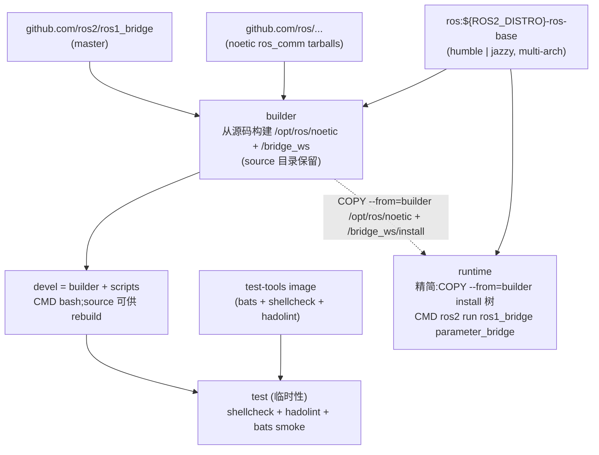

# ROS 1 Bridge Docker Environment

**[English](../README.md)** | **[繁體中文](README.zh-TW.md)** | **[简体中文](README.zh-CN.md)** | **[日本語](README.ja.md)**

> **TL;DR** — ROS 1/2 bridge 容器，**同时支持 Humble + Jazzy**，base image 为 `ros:${ROS2_DISTRO}-ros-base`，**Noetic `ros_comm` 从源码构建** + **`ros1_bridge` 从源码构建**（因为 Foxy / Noetic apt 在 focal 之外已经没有包）。通过 `ARG ROS2_DISTRO=humble|jazzy` 选择目标。base image 为 multi-arch，支持 Jetson (arm64)。完整 migration rationale 见 [#53](https://github.com/ycpss91255-docker/ros1_bridge/issues/53)。
>
> ```bash
> ./build.sh && ./run.sh           # 默认 ROS2_DISTRO=humble（在 setup.conf [build] arg_4 设置）
> ```

---

## 目录

- [特性](#特性)
- [快速开始](#快速开始)
- [切换 ROS 2 distro](#切换-ros-2-distro)
- [使用方式](#使用方式)
- [Bridge 设置](#bridge-设置)
- [Demo](#demo)
- [架构](#架构)
- [目录结构](#目录结构)

---

## 特性

- **ROS 1 + bridge 从源码构建**：`ros:${ROS2_DISTRO}-ros-base` 为 base；Noetic `ros_comm` 通过 `rosinstall_generator` 抓 tarball 构建到 `/opt/ros/noetic/`；`ros1_bridge` 从 `ros2/ros1_bridge` master 构建到 `/bridge_ws/install/`。同时支持 Humble (jammy) 与 Jazzy (noble)，通过 `ARG ROS2_DISTRO` matrix 选择。
- **为什么从源码构建**：Open Robotics 从未在 focal 以外发布 `ros-noetic-*` debs，且 `ros-jazzy-ros1-bridge` 不存在。`humble|jazzy ↔ foxy ↔ noetic` 的 chained DDS 变通方案实测因 Fast-DDS 大版本差异 + REP-2011 type-hash 不匹配而失败，完整调查见 [#53](https://github.com/ycpss91255-docker/ros1_bridge/issues/53)。
- **Jetson (arm64) 支持**：base image 为 multi-arch（不同于仅 amd64 的 `osrf/ros:foxy-ros1-bridge`）
- **Parameter bridge**：通过 YAML 设置可配置的 topic 桥接
- **builder / devel / runtime 分离**:`builder` stage 从源码构建 Noetic + `ros1_bridge` 并**保留 source 目录**(`/noetic_ws/src/` 和 `/bridge_ws/src/ros1_bridge/`);`devel` (`FROM builder`) 继承 source 供容器内 rebuild / debug,默认进 shell (`CMD bash`);`runtime` (`FROM ${IMAGE}`,**不继承 devel**) 为精简版,仅 `COPY --from=builder` install 树,自动运行 `parameter_bridge` 读取 `/bridge.yaml`
- **Docker Compose**：一个 `compose.yaml` 管理构建与执行
- **示例设置**：内含 scan 和 camera bridge 设置文件

## 快速开始

```bash
# 1. 构建
./build.sh

# 2. 执行（需要 ROS master 已启动）
./run.sh

# 3. 进入已启动的容器
./exec.sh
```

## 切换 ROS 2 distro

默认 `humble`(jammy 22.04)。要切到 `jazzy`(noble 24.04):

**方式 1(推荐):编辑 `setup.conf`**。改 `[build]` section 的 `arg_4`:

```ini
[build]
arg_4 = ROS2_DISTRO=jazzy
```

然后 rebuild。`setup.sh` 会把 `setup.conf` hash 进 `.env` 的 `SETUP_CONF_HASH`,
所以 `./build.sh` / `./run.sh` 会自动检测变动并重新生成 `.env` + `compose.yaml`。
image tag(`yunchien/ros1_bridge:devel` 等)跨 distro 不变,切换 = 原地 rebuild。

```bash
./build.sh           # 从 setup.conf 抓新的 ROS2_DISTRO
./run.sh
```

**方式 2:一次性 `--build-arg`(直接 docker build)**。会绕开 `./build.sh`,
不会更新 `.env` / `compose.yaml`:

```bash
docker build --target devel --build-arg ROS2_DISTRO=jazzy -t ros1_bridge:devel .
```

CI 通过 `.github/workflows/main.yaml` 的 matrix 同时 build 两个 distro,所以
setup.conf 改动只影响本地 build;发布到 `ghcr.io/ycpss91255-docker/ros1_bridge-{humble,jazzy}`
的 image 跟 setup.conf 无关,永远由 matrix 决定。

## 使用方式

### 构建

```bash
./build.sh                       # 构建 devel（默认）
./build.sh test                  # 构建含 smoke test

docker compose build devel     # 等效命令
```

### 执行

按 stage target 分两种模式：

```bash
./run.sh                         # devel：交互 bash shell，不会自动运行 bridge
./run.sh -d                      # devel 后台运行，之后用 ./exec.sh 进入
```

`runtime`（自动启动 bridge）目前需要直接用 `docker run` —— 自动生成的
`compose.yaml` 尚未 emit `runtime` service（template 端追踪中）：

```bash
docker build --target runtime -t ros1_bridge:runtime .
docker run --rm --network=host ros1_bridge:runtime
# entrypoint 会 source 两个 ROS、rosparam load /bridge.yaml，
# 然后 exec `ros2 run ros1_bridge parameter_bridge`。
# 前提：host network 上已启动 roscore。
```

### 进入已启动的容器

```bash
./exec.sh
./exec.sh bash
```

## Bridge 设置

`bridge.yaml` **不纳入版本控制** — 从 `config/` 挑一份配置，构建前用
symlink 指过去：

```bash
ln -sf config/scan_bridge.yaml bridge.yaml          # LaserScan
ln -sf config/release_bridge.yaml bridge.yaml       # RealSense camera + depth
ln -sf config/demo_bridge.yaml bridge.yaml          # std_msgs/String chatter demo
ln -sf config/demo_services_1to2.yaml bridge.yaml   # ROS 1 → ROS 2 service demo
ln -sf config/demo_services_2to1.yaml bridge.yaml   # ROS 2 → ROS 1 service demo
```

| 配置 | Bridge 内容 |
|------|-------------|
| `config/scan_bridge.yaml` | LaserScan `/scan`（sensor-data QoS） |
| `config/release_bridge.yaml` | RealSense camera + depth topics |
| `config/demo_bridge.yaml` | 双向 `std_msgs/String` chatter（给 `ros{1,2}_server.sh` demo 使用） |
| `config/demo_services_1to2.yaml` | ROS 1 service 暴露给 ROS 2（`/add_two_ints`、`/static_map`） |
| `config/demo_services_2to1.yaml` | ROS 2 service 暴露给 ROS 1（`/get_parameters`） |

> 两个 service demo 需要的 type conversion 没编进这里从源码构建的
> `ros1_bridge`，runtime 会打印 `no conversion for type ...`，除非在 `colcon
> build` 步骤把对应的 ROS 1 / ROS 2 packages 加进去重新编译 image。

不想改 symlink 也可以直接 build 时覆盖：

```bash
docker compose build --build-arg BRIDGE_FILE=config/release_bridge.yaml devel
```

### YAML 格式

Topic 的 `type` 使用 ROS 2 格式 `<package>/msg/<MsgName>`；service 的 `type`
则使用 ROS 1 格式 `<package>/<SrvName>`（此不对称为 `parameter_bridge` 的
刻意设计）。Topic 可通过 `qos` 字段设置 QoS，完整可调项目请见
[`config/`](../config/) 各配置文件。

```yaml
topics:
  - topic: /scan
    type: sensor_msgs/msg/LaserScan
    queue_size: 10
    qos:
      history: keep_last
      depth: 5
      reliability: best_effort
      durability: volatile

services_1_to_2:
  - service: /add_two_ints
    type: example_interfaces/AddTwoInts

services_2_to_1:
  - service: /get_parameters
    type: rcl_interfaces/GetParameters
```

## Demo

两个 terminal 跑 end-to-end bridge demo，消息类型 `std_msgs/String`。
规则对称:**server** terminal 负责起 `roscore` + `parameter_bridge`
(读 build 时烤进 image 的 `/demo_bridge.yaml`)，**client** terminal 只订阅。

| Demo | Terminal 1 (server) | Terminal 2 (client) |
|------|---------------------|---------------------|
| A — ROS 1 → ROS 2 | `./exec.sh /ros1_server.sh` | `./exec.sh /ros2_client.sh` |
| B — ROS 2 → ROS 1 | `./exec.sh /ros2_server.sh` | `./exec.sh /ros1_client.sh` |

实际操作(假设容器已用 `./run.sh -d` 起好):

```bash
# Terminal 1 (server) — 二选一
./exec.sh /ros1_server.sh    # Demo A
./exec.sh /ros2_server.sh    # Demo B

# Terminal 2 (client) — 对应的另一半
./exec.sh /ros2_client.sh    # Demo A
./exec.sh /ros1_client.sh    # Demo B
```

Server 脚本每一步都打印进度(`[ros1_server] step N/5: ...`)，所以
`roscore` 跟 `parameter_bridge` 何时就绪一目了然。要换消息字串用
`MESSAGE` 环境变量:

```bash
./exec.sh env MESSAGE="hi from ROS 1" /ros1_server.sh
```

Server terminal 按 `Ctrl+C` 会收掉 `parameter_bridge` 跟 `roscore`，
client terminal 接着就 EOF。

## 架构



## Smoke Tests

详见 [TEST.md](test/TEST.md)。

## 目录结构

```text
ros1_bridge/
├── compose.yaml                 # Docker Compose 定义
├── Dockerfile                   # 多阶段构建（devel + runtime + test）；source-builds Noetic + ros1_bridge
├── setup.conf                   # Repo override；[build] arg_4=ROS2_DISTRO 选 humble|jazzy
├── build.sh -> template/build.sh    # Symlink
├── run.sh -> template/run.sh        # Symlink
├── exec.sh -> template/exec.sh      # Symlink
├── stop.sh -> template/stop.sh      # Symlink
├── Makefile -> template/Makefile    # Symlink
├── .template_version            # Template subtree 版本（v0.4.1）
├── template/                    # 共用脚本、测试、CI（git subtree）
├── script/
│   ├── entrypoint.sh            # Source ROS 1 + ROS 2，载入 bridge 设置
│   ├── ros_entrypoint.sh        # 仅 source ROS 环境（兼容 osrf）
│   ├── ros1_server.sh           # Demo A publisher（自起 roscore + bridge）
│   ├── ros1_client.sh           # Demo B subscriber
│   ├── ros2_server.sh           # Demo B publisher（自起 roscore + bridge）
│   └── ros2_client.sh           # Demo A subscriber
├── bridge.yaml                  # Symlink 到 config/*.yaml 之一（gitignored，操作者自选）
├── config/                      # Bridge 配置文件
│   ├── scan_bridge.yaml         # LaserScan bridge
│   ├── release_bridge.yaml      # Camera + depth bridge
│   ├── demo_bridge.yaml         # 双向 std_msgs/String chatter
│   ├── demo_services_1to2.yaml  # ROS 1 → ROS 2 service demo
│   └── demo_services_2to1.yaml  # ROS 2 → ROS 1 service demo
├── doc/                         # 翻译版 README
│   ├── README.zh-TW.md          # 繁体中文
│   ├── README.zh-CN.md          # 简体中文
│   └── README.ja.md             # 日文
├── .github/workflows/
│   └── main.yaml                # CI/CD（调用 template reusable workflows）
└── test/smoke/                  # Bats 环境测试（repo 专属）
    └── ros_env.bats
```
