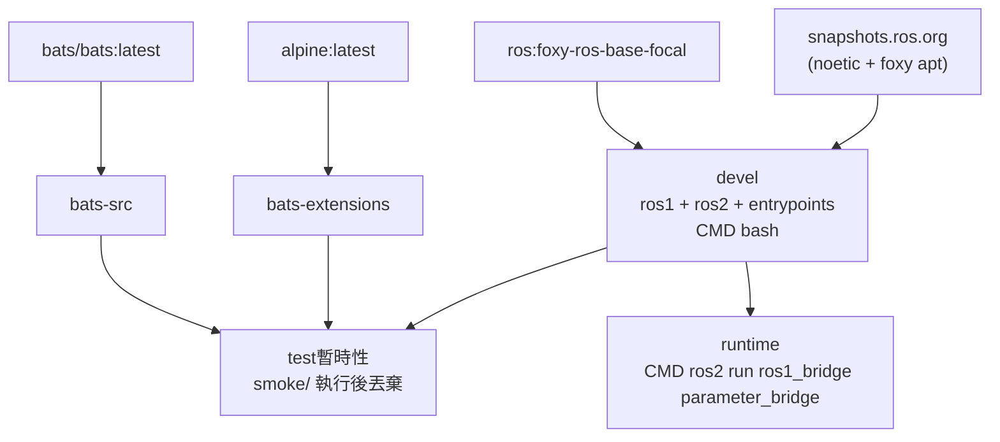

# ROS 1 Bridge Docker Environment

**[English](../README.md)** | **[繁體中文](README.zh-TW.md)** | **[简体中文](README.zh-CN.md)** | **[日本語](README.ja.md)**

> **TL;DR** — 以 `ros:foxy-ros-base-focal` 加 ROS 1 snapshot apt repo 自建的 ROS 1/2 bridge 容器。透過 `parameter_bridge` 橋接 ROS 1 (Noetic) 與 ROS 2 (Foxy) topics。base image 為 multi-arch，支援 Jetson (arm64)。
>
> ```bash
> ./build.sh && ./run.sh
> ```

---

## 目錄

- [特色](#特色)
- [快速開始](#快速開始)
- [使用方式](#使用方式)
- [Bridge 設定](#bridge-設定)
- [架構](#架構)
- [目錄結構](#目錄結構)

---

## 特色

- **自建 bridge 映像**：以 `ros:foxy-ros-base-focal` 為底，透過 ROS 1 snapshot apt repo 併裝 ROS 1 Noetic 與 ROS 2 Foxy
- **Jetson (arm64) 支援**：base image 為 multi-arch（不同於僅 amd64 的 `osrf/ros:foxy-ros1-bridge`）
- **Parameter bridge**：透過 YAML 設定可配置的 topic 橋接
- **devel / runtime 分離**：`devel` stage 預設進 shell（`CMD bash`）方便開發除錯；`runtime` stage 自動執行 `parameter_bridge` 讀取 `/bridge.yaml`
- **雙 entrypoint**：`/entrypoint.sh`（source 兩個 ROS + `rosparam load /bridge.yaml`）與 `/ros_entrypoint.sh`（純 ROS 環境，相容 osrf 慣例）
- **Smoke Test**：Bats 測試驗證兩個 ROS 環境及 bridge 可用性
- **Docker Compose**：一個 `compose.yaml` 管理建置與執行
- **範例設定**：內含 scan 和 camera bridge 設定檔

## 快速開始

```bash
# 1. 建置
./build.sh

# 2. 執行（需要 ROS master 已啟動）
./run.sh

# 3. 進入已啟動的容器
./exec.sh
```

## 使用方式

### 建置

```bash
./build.sh                       # 建置 devel（預設）
./build.sh test                  # 建置含 smoke test

docker compose build devel     # 等效指令
```

### 執行

依 stage target 分兩種模式：

```bash
./run.sh                         # devel：互動 bash shell，不會自動跑 bridge
./run.sh -d                      # devel 背景執行，之後用 ./exec.sh 進入
```

`runtime`（自動啟動 bridge）目前需要直接用 `docker run` —— 自動產生的
`compose.yaml` 尚未 emit `runtime` service（template 端追蹤中）：

```bash
docker build --target runtime -t ros1_bridge:runtime .
docker run --rm --network=host ros1_bridge:runtime
# entrypoint 會 source 兩個 ROS、rosparam load /bridge.yaml，
# 然後 exec `ros2 run ros1_bridge parameter_bridge`。
# 前提：host network 上已啟動 roscore。
```

### 進入已啟動的容器

```bash
./exec.sh
./exec.sh bash
```

## Bridge 設定

預設 bridge 設定為 `bridge.yaml`。額外設定檔在 `config/` 目錄：

| 檔案 | 說明 |
|------|------|
| `bridge.yaml` | 預設設定（LaserScan `/scan`） |
| `config/scan_bridge.yaml` | LaserScan bridge |
| `config/release_bridge.yaml` | Camera + depth topics bridge |

使用不同設定重新建置：

```bash
docker compose build --build-arg BRIDGE_FILE=config/release_bridge.yaml devel
```

### YAML 格式

Topic 的 `type` 使用 ROS 2 格式 `<package>/msg/<MsgName>`；service 的 `type`
則使用 ROS 1 格式 `<package>/<SrvName>`（此不對稱為 `parameter_bridge` 的
刻意設計）。Topic 可透過 `qos` 欄位設定 QoS，完整可調項目請見
[`bridge.yaml`](../bridge.yaml)。

```yaml
topics:
  - topic: /scan
    type: sensor_msgs/msg/LaserScan
    queue_size: 10
    qos:
      history: keep_last
      depth: 5
      reliability: best_effort
      durability: volatile

services_1_to_2:
  - service: /add_two_ints
    type: example_interfaces/AddTwoInts

services_2_to_1:
  - service: /get_parameters
    type: rcl_interfaces/GetParameters
```

## 架構



## Smoke Tests

詳見 [TEST.md](test/TEST.md)。

## 目錄結構

```text
ros1_bridge/
├── compose.yaml                 # Docker Compose 定義
├── Dockerfile                   # 多階段建置（devel + runtime + test）
├── build.sh -> template/build.sh    # Symlink
├── run.sh -> template/run.sh        # Symlink
├── exec.sh -> template/exec.sh      # Symlink
├── stop.sh -> template/stop.sh      # Symlink
├── Makefile -> template/Makefile    # Symlink
├── .template_version            # Template subtree 版本（v0.4.1）
├── template/                    # 共用腳本、測試、CI（git subtree）
├── script/
│   ├── entrypoint.sh            # Source ROS 1 + ROS 2，載入 bridge 設定
│   └── ros_entrypoint.sh        # 僅 source ROS 環境（相容 osrf）
├── bridge.yaml                  # 預設 bridge 設定
├── config/                      # 額外 bridge 設定
│   ├── scan_bridge.yaml         # LaserScan bridge
│   └── release_bridge.yaml      # Camera + depth bridge
├── doc/                         # 翻譯版 README
│   ├── README.zh-TW.md          # 繁體中文
│   ├── README.zh-CN.md          # 簡體中文
│   └── README.ja.md             # 日文
├── .github/workflows/
│   └── main.yaml                # CI/CD（呼叫 template reusable workflows）
└── test/smoke/                  # Bats 環境測試（repo 專屬）
    └── ros_env.bats
```
