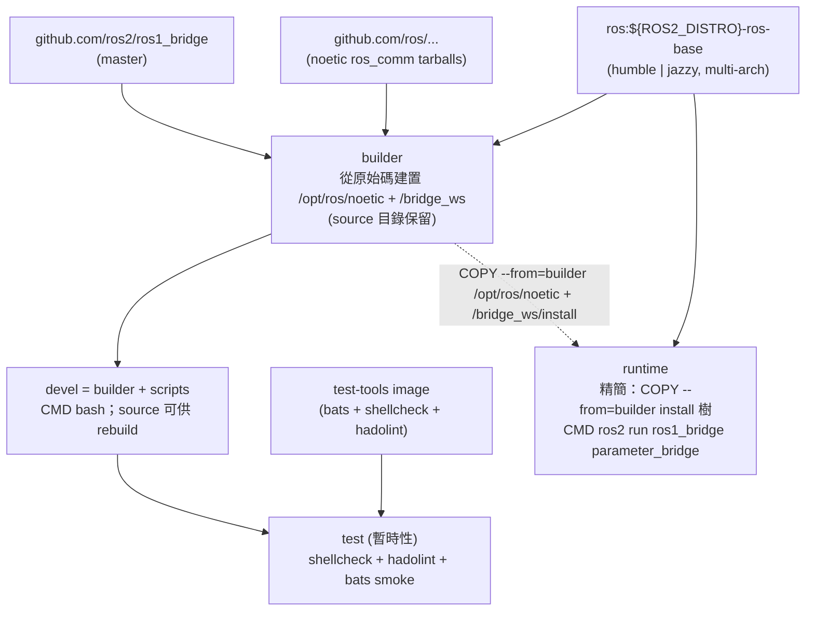

# ROS 1 Bridge Docker Environment

[](https://github.com/ycpss91255-docker/ros1_bridge/actions/workflows/main.yaml) [](../LICENSE)

ROS 1/2 bridge 容器，**Humble + Jazzy 雙 target** — `ros:${ROS2_DISTRO}-ros-base` 加 source-build Noetic `ros_comm` 與 `ros1_bridge`。Multi-arch（amd64 / arm64）。

**[English](../README.md)** | **[繁體中文](README.zh-TW.md)** | **[简体中文](README.zh-CN.md)** | **[日本語](README.ja.md)**

---

## 目錄

- [TL;DR](#tldr)
- [Overview](#overview)
- [特色](#特色)
- [快速開始](#快速開始)
- [切換 ROS 2 distro](#切換-ros-2-distro)
- [使用方式](#使用方式)
- [Bridge 設定](#bridge-設定)
- [Demo](#demo)
- [架構](#架構)
- [Smoke Tests](#smoke-tests)
- [目錄結構](#目錄結構)

---

## TL;DR

### Demo（端到端 ROS 1 / ROS 2 bridging）

```bash
make build && make run -- -d

# Terminal 1 — roscore + bridge + ROS 1 publisher (10 Hz)
make exec -- /root/demo/ros1_server.sh

# Terminal 2 — ROS 2 subscriber 接收 bridged 訊息
make exec -- /root/demo/ros2_client.sh
```

### Production（headless bridge daemon）

```bash
# 前置條件：host network 上必須已有 roscore 在執行
make build && make run -- -t runtime -d

# 檢查 bridge 狀態
docker logs -f $(docker ps -qf name=ros1_bridge-runtime)
```

> 預設 ROS2\_DISTRO=humble（在 `setup.conf [build] arg_4` 設定）。
> 未建立 `bridge.yaml` symlink 時自動 fallback 到
> `config/ros1_bridge/demo_bridge.yaml` — 完整可選設定見
> [Bridge 設定](#bridge-設定)。

## Overview

`osrf/ros:foxy-ros1-bridge` 的傳統發行路徑在現代 host 上已經行不通：
Open Robotics 從未在 focal 之外發布 `ros-noetic-*` debs，且
`ros-jazzy-ros1-bridge` 也不存在。`humble|jazzy ↔ foxy ↔ noetic`
的 chained DDS 變通方案實測因 Fast-DDS 大版本差異 + REP-2011 type-hash
不匹配而失敗。本 repo 改成單一 Dockerfile，在
`ros:${ROS2_DISTRO}-ros-base` 之上 source-build Noetic `ros_comm` +
`ros1_bridge`，透過 `ARG ROS2_DISTRO=humble|jazzy` 選擇目標，
multi-arch（amd64 + arm64 含 Jetson）。完整 migration rationale 見
[#53](https://github.com/ycpss91255-docker/ros1_bridge/issues/53)。

## 特色

- **ROS 1 + bridge 從原始碼建置**：`ros:${ROS2_DISTRO}-ros-base` 為 base；Noetic `ros_comm` 透過 `rosinstall_generator` 抓 tarball 建置到 `/opt/ros/noetic/`；`ros1_bridge` 從 `ros2/ros1_bridge` master 建置到 `/bridge_ws/install/`。同時支援 Humble (jammy) 與 Jazzy (noble)，透過 `ARG ROS2_DISTRO` matrix 選擇。
- **Jetson (arm64) 支援**：base image 為 multi-arch（不同於僅 amd64 的 `osrf/ros:foxy-ros1-bridge`）
- **Parameter bridge**：透過 YAML 設定可配置的 topic 橋接
- **builder / devel / runtime 分離**：`builder` stage 從原始碼編 Noetic + `ros1_bridge` 並**保留 source 目錄**（`/noetic_ws/src/` 與 `/bridge_ws/src/ros1_bridge/`）；`devel`（`FROM builder`）繼承 source 給容器內 rebuild / debug，預設進 shell（`CMD bash`）；`runtime`（`FROM ${IMAGE}`，**不繼承 devel**）為精簡版，只 `COPY --from=builder` install 樹，自動執行 `parameter_bridge` 讀取 `/bridge.yaml`
- **Docker Compose**：一個 `compose.yaml` 管理建置與執行
- **範例設定**：內含 scan 和 camera bridge 設定檔

## 快速開始

```bash
# 0.（選用）挑一份 bridge 設定。略過則 fallback 到
#    config/ros1_bridge/demo_bridge.yaml — 詳見下方「Bridge 設定」。
ln -sf config/ros1_bridge/demo_bridge.yaml bridge.yaml

# 1. 建置
make build

# 2. 執行（需要 ROS master 已啟動）
make run

# 3. 進入已啟動的容器
make exec
```

## 切換 ROS 2 distro

預設 `humble`（jammy 22.04）。要切到 `jazzy`（noble 24.04），透過 CLI
更新 `setup.conf [build] arg_4`：

```bash
./script/setup.sh set build.arg_4 ROS2_DISTRO=jazzy
make build && make run
```

`set` 把值寫進 `setup.conf [build] arg_4`（section / key 不存在會建好）。
`make build` 接著透過 `.env` 裡的 `setup.conf` hash 偵測到變動，自動
重生 `.env` + `compose.yaml` 並 rebuild。image tag（`yunchien/ros1_bridge:devel`
等）跨 distro 不變，切換 = 原地 rebuild。

要互動式編輯，跑 `make setup-tui`（dialog / whiptail 前端），在 TUI 裡
改 `[build] arg_4`。

CI 透過 `.github/workflows/main.yaml` 的 matrix 同時 build 兩個 distro，所以
setup.conf 改動只影響本地 build；發布到 `ghcr.io/ycpss91255-docker/ros1_bridge-{humble,jazzy}`
的 image 跟 setup.conf 無關，永遠由 matrix 決定。

## 使用方式

### 建置

```bash
make build                       # 建置 devel（預設）
make build test                  # 建置含 smoke test
make build -- -t runtime         # 建置精簡的 runtime image
```

### 執行

依 stage target 分兩種模式：

```bash
make run                         # devel：互動 bash shell，不會自動跑 bridge
make run -- -d                   # devel 背景執行，之後用 make exec 進入
```

`runtime`（透過 Dockerfile `CMD` 自動啟動 bridge）：

> **前置條件：** 啟動 runtime 容器前，host network 上必須已有 `roscore`
> 在執行。否則 `parameter_bridge` 只會印一次 `Connection refused` 後
> 進入靜默 idle，不再有任何輸出。

```bash
make run -- -t runtime           # 啟動 runtime service。entrypoint 會 source 兩個
                                 # ROS、rosparam load /bridge.yaml，然後 exec
                                 # `ros2 run ros1_bridge parameter_bridge`。
```

### 進入已啟動的容器

```bash
make exec
make exec bash
```

## Bridge 設定

`bridge.yaml` **不納入版本控管** — 它是 per-clone symlink，由操作者從
`config/` 挑一份指過去。建置時若 symlink 不存在或斷裂，Dockerfile 會
自動 fallback 到 `config/ros1_bridge/demo_bridge.yaml`（修 [#65](https://github.com/ycpss91255-docker/ros1_bridge/issues/65)），
所以 fresh clone 也能直接 build。要挑其他設定：

```bash
ln -sf config/ros1_bridge/scan_bridge.yaml bridge.yaml          # LaserScan
ln -sf config/ros1_bridge/release_bridge.yaml bridge.yaml       # RealSense camera + depth
ln -sf config/ros1_bridge/demo_bridge.yaml bridge.yaml          # std_msgs/String chatter demo（也是 fallback 預設）
ln -sf config/ros1_bridge/demo_services_1to2.yaml bridge.yaml   # ROS 1 → ROS 2 service demo
ln -sf config/ros1_bridge/demo_services_2to1.yaml bridge.yaml   # ROS 2 → ROS 1 service demo
```

| 設定檔 | Bridge 內容 |
|--------|-------------|
| `config/ros1_bridge/scan_bridge.yaml` | LaserScan `/scan`（sensor-data QoS） |
| `config/ros1_bridge/release_bridge.yaml` | RealSense camera + depth topics |
| `config/ros1_bridge/demo_bridge.yaml` | 雙向 `std_msgs/String` chatter（給 `ros{1,2}_server.sh` demo 使用） |
| `config/ros1_bridge/demo_services_1to2.yaml` | ROS 1 service 暴露給 ROS 2（`/add_two_ints`、`/static_map`） |
| `config/ros1_bridge/demo_services_2to1.yaml` | ROS 2 service 暴露給 ROS 1（`/get_parameters`） |

> 兩個 service demo 需要的 type conversion 並未編進這裡從原始碼建置的
> `ros1_bridge`，runtime 會印 `no conversion for type ...`，除非在 `colcon
> build` 步驟把對應的 ROS 1 / ROS 2 packages 加進去重新編譯 image。

### YAML 格式

Topic 的 `type` 使用 ROS 2 格式 `<package>/msg/<MsgName>`；service 的 `type`
則使用 ROS 1 格式 `<package>/<SrvName>`（此不對稱為 `parameter_bridge` 的
刻意設計）。Topic 可透過 `qos` 欄位設定 QoS，完整可調項目請見
[`config/`](../config/) 各設定檔。

```yaml
topics:
  - topic: /scan
    type: sensor_msgs/msg/LaserScan
    queue_size: 10
    qos:
      history: keep_last
      depth: 5
      reliability: best_effort
      durability: volatile

services_1_to_2:
  - service: /add_two_ints
    type: example_interfaces/AddTwoInts

services_2_to_1:
  - service: /get_parameters
    type: rcl_interfaces/GetParameters
```

## Demo

兩個 terminal 跑 end-to-end bridge demo，訊息型別 `std_msgs/String`。
規則對稱：**server** terminal 負責起 `roscore` + `parameter_bridge`
（讀 build 時烤進 image 的 `/demo_bridge.yaml`），**client** terminal 只訂閱。

| Demo | Terminal 1 (server) | Terminal 2 (client) |
|------|---------------------|---------------------|
| A — ROS 1 → ROS 2 | `make exec -- /root/demo/ros1_server.sh` | `make exec -- /root/demo/ros2_client.sh` |
| B — ROS 2 → ROS 1 | `make exec -- /root/demo/ros2_server.sh` | `make exec -- /root/demo/ros1_client.sh` |

實際操作（假設容器已用 `make run -- -d` 起好）：

```bash
# Terminal 1 (server) — 二選一
make exec -- /root/demo/ros1_server.sh    # Demo A
make exec -- /root/demo/ros2_server.sh    # Demo B

# Terminal 2 (client) — 對應的另一半
make exec -- /root/demo/ros2_client.sh    # Demo A
make exec -- /root/demo/ros1_client.sh    # Demo B
```

Server 腳本每一步都印出進度（`[ros1_server] step N/5: ...`），所以
`roscore` 跟 `parameter_bridge` 何時就緒一目了然。要換訊息字串用
`MESSAGE` 環境變數：

```bash
./script/exec.sh env MESSAGE="hi from ROS 1" /root/demo/ros1_server.sh
```

Server terminal 按 `Ctrl+C` 會收掉 `parameter_bridge` 跟 `roscore`，
client terminal 接著就 EOF。

## 架構



## Smoke Tests

詳見 [TEST.md](test/TEST.md)。

## 目錄結構

```text
ros1_bridge/
├── compose.yaml                 # Docker Compose 定義
├── Dockerfile                   # 多階段建置（devel + runtime + test）；source-builds Noetic + ros1_bridge
├── setup.conf                   # Repo override；[build] arg_4=ROS2_DISTRO 選 humble|jazzy
├── Makefile -> .base/script/docker/Makefile     # Symlink（統一入口：make build/run/exec/stop）
├── .base/                    # 共用腳本、測試、CI（git subtree；版本紀錄在 .base/.version）
├── script/
│   ├── build.sh -> ../.base/script/docker/build.sh    # Wrapper symlinks
│   ├── run.sh -> ../.base/script/docker/run.sh
│   ├── exec.sh -> ../.base/script/docker/exec.sh
│   ├── stop.sh -> ../.base/script/docker/stop.sh
│   ├── setup.sh -> ../.base/script/docker/setup.sh
│   ├── setup_tui.sh -> ../.base/script/docker/setup_tui.sh
│   ├── prune.sh -> ../.base/script/docker/prune.sh
│   ├── entrypoint.sh            # Source ROS 1 + ROS 2，載入 bridge 設定
│   ├── ros_entrypoint.sh        # 僅 source ROS 環境（相容 osrf）
│   ├── ros1_server.sh           # Demo A publisher（自起 roscore + bridge）
│   ├── ros1_client.sh           # Demo B subscriber
│   ├── ros2_server.sh           # Demo B publisher（自起 roscore + bridge）
│   └── ros2_client.sh           # Demo A subscriber
├── bridge.yaml                  # Symlink 到 config/ros1_bridge/*.yaml 之一（gitignored，操作者自選）
├── config/
│   └── ros1_bridge/             # Bridge 設定檔（namespaced；保留 config/ 給 template overlay 用）
│       ├── scan_bridge.yaml         # LaserScan bridge
│       ├── release_bridge.yaml      # Camera + depth bridge
│       ├── demo_bridge.yaml         # 雙向 std_msgs/String chatter（也是 fallback 預設）
│       ├── demo_services_1to2.yaml  # ROS 1 → ROS 2 service demo
│       └── demo_services_2to1.yaml  # ROS 2 → ROS 1 service demo
├── doc/                         # 翻譯版 README
│   ├── README.zh-TW.md          # 繁體中文
│   ├── README.zh-CN.md          # 簡體中文
│   └── README.ja.md             # 日文
├── .github/workflows/
│   └── main.yaml                # CI/CD（呼叫 template reusable workflows）
└── test/smoke/                  # Bats 環境測試（repo 專屬）
    └── ros_env.bats
```
